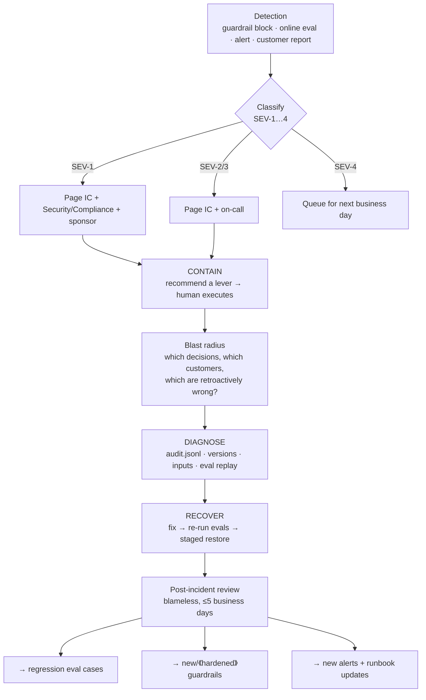

# DISASTER_COMMAND.md — incident command for AI systems

Everything before this document is about shipping safely. This one is about the
morning it goes wrong in production, with a customer executive on the phone.

AI incidents differ from ordinary outages in three ways, and the response has to
account for all three: the system can be **confidently wrong while fully healthy**
(every dashboard green, every answer wrong); the blast radius is **retroactive**
(decisions already made and acted on); and the fix is often **not a code deploy**
but a model, prompt, or threshold change.

Driven by the `incident-commander` agent. Governed by `CONSTITUTION.md` — the agent
recommends, **a human executes** every containment action.

---

## 1. Severity matrix

| Sev | Definition | Detection source | Response SLA | Paged |
|---|---|---|---|---|
| **SEV-1** | Safety or regulatory breach — PII/PHI in output, an autonomous action taken past a guardrail, a consequential decision made without required human review, prompt injection executed | Guardrail block events in `audit.jsonl` · DLP alert · customer report | **Immediate**, 24×7 | IC + Security + Compliance + exec sponsor |
| **SEV-2** | Quality collapse — a metric bar breached in production, hallucination-rate spike, online/offline eval divergence, HITL override rate doubling | Online eval · shadow sampling · override-rate alert | **30 min**, business hours + on-call | IC + model owner + product |
| **SEV-3** | Degradation — p95 latency or cost bar breached, elevated error rate, retrieval quality drop, fallback path saturated | Golden signals in `11-observability.md` | **2 hours** | On-call + platform |
| **SEV-4** | Drift warning — input distribution shift, confidence drift, upstream model deprecation notice, golden-set staleness | Drift triggers | **Next business day** | Model owner |

**Escalation rule:** any SEV-2 touching regulated data, or any SEV-3 that cannot be
contained within its SLA, escalates one level. When in doubt, escalate — an
over-declared incident costs an hour; an under-declared SEV-1 costs the engagement.

## 2. Incident command structure

| Role | Owns |
|---|---|
| **Incident Commander** | The incident. Declares severity, runs the runbook, makes the call to escalate. Does *not* debug — commands. |
| **Ops lead** | Executes containment and recovery actions (the human hand on every switch) |
| **Comms lead** | Customer, exec, and internal updates on a fixed cadence |
| **Scribe** | The timeline — every observation, decision, and action, timestamped |

### The AI-specific decision: what to pull

Containment options, in ascending order of business impact. The IC recommends; the
human decides and executes.

| Lever | Use when | Cost |
|---|---|---|
| **Tighten the confidence threshold** | Quality degraded but the system is mostly right | More human review, slower throughput |
| **Force full HITL mode** | Output can't be trusted unreviewed, but the workflow still has value | Throughput drops to human speed |
| **Fall back to the previous model/prompt version** | The regression arrived with a version change | Loses recent improvements |
| **Serve cached/deterministic responses** | The model path is the problem, the workflow isn't | Reduced coverage |
| **Kill switch — feature flag off** | SEV-1, or any unbounded blast radius | Full loss of the capability |

**Bias to containment.** Restoring throughput is not the objective; stopping harm
is. A system that is off is not producing wrong answers.

## 3. Incident flow

## 4. Runbooks

Each: **detect → contain → diagnose → recover → follow-up.**

### R1 · Hallucination spike
**Detect** — groundedness score drops, citation-validity failures rise, HITL override rate jumps.
**Contain** — raise the confidence threshold; route the affected case type to full human review.
**Diagnose** — did the prompt, the model version, the retrieval corpus, or the input mix change? Replay the failing cases against the previous version to isolate.
**Recover** — revert the offending change, or add the grounding constraint; re-run the full eval suite; restore by cohort.
**Follow-up** — every hallucinated case becomes a regression case; add a groundedness bar to `bars.yaml` if one was missing.

### R2 · Prompt injection detected in production
**Detect** — injection-quarantine events firing, or an agent taking an action outside its charter.
**Contain** — **SEV-1 by default.** Kill switch on the affected tool path; quarantine the source documents; disable non-essential tools.
**Diagnose** — trace `audit.jsonl` for the injected content and what it caused. Establish whether any action was executed and what it touched.
**Recover** — treat all fetched content strictly as data; re-scope tool permissions to least privilege; add the payload family to the adversarial set; restore tools one at a time.
**Follow-up** — security review of every tool the agent can call; the payload becomes a permanent adversarial case.

### R3 · Cost runaway
**Detect** — cost-per-unit bar breached; spend anomaly.
**Contain** — enforce rate/spend limits; downshift to the cheaper model tier; cap retries and agent loop depth.
**Diagnose** — retry storm? loop without a termination condition? oversized context? traffic spike? unintended escalation to the expensive fallback?
**Recover** — fix the loop/retry logic, re-tune the routing cascade, re-measure cost per unit against the bar.
**Follow-up** — cost regression test in CI; alert threshold set below the business-case break-even, not at it.

### R4 · Upstream model outage or deprecation
**Detect** — provider errors, elevated latency, or a deprecation notice.
**Contain** — activate the routing fallback from `05-architecture.md` (this is what it was designed for); if quality drops, tighten thresholds to compensate.
**Diagnose** — regional or global? version-specific? Confirm the fallback's quality against the current bars — a fallback that has never been evaluated is a guess.
**Recover** — run on fallback, or migrate; re-run evals on the replacement before restoring full autonomy.
**Follow-up** — evaluate every fallback path on the standing eval schedule; track provider deprecation calendars in `11-observability.md`.

### R5 · Eval/production divergence
**Detect** — shadow-sampled online score materially below the offline score.
**Contain** — treat production quality as the truth: tighten thresholds to the level the online score justifies.
**Diagnose** — the golden set no longer represents reality (most common), or the production path differs from the eval path (preprocessing, context assembly, retrieval).
**Recover** — resample the golden set from current traffic, re-stratify, re-baseline the bars if the business case still holds.
**Follow-up** — golden-set refresh cadence; divergence alarm becomes standing.

## 5. Customer and executive communication

Send on a fixed cadence (SEV-1: every 30 minutes even when nothing changed —
silence is what destroys trust). Five parts, in this order:

1. **What happened** — plain language, no blame, no speculation on cause.
2. **Blast radius** — how many decisions/customers/records, over what window, and
   which are retroactively wrong. Say "still being determined" if it is.
3. **Containment** — what is switched off or under human review *right now*.
4. **ETA** — for the next update, not for the fix, until the fix is actually known.
5. **Evidence** — the audit trail exists and will support the full account.

> **Never** report a blast radius you haven't verified from `audit.jsonl`. An
> under-stated first number that grows later is worse than "still determining".

## 6. Post-incident review

Blameless, within five business days, written to
`artifacts/incidents/<date>-<slug>.md`: timeline, severity and why, blast radius
with evidence, decisions made and by whom, what worked, what didn't, and follow-up
actions with owners and dates.

**A review that produces no artifact change is incomplete.** Every incident must
yield at least one of: a regression eval case (`EVALS.md`), a new or hardened
guardrail (`HARNESS.md`), a new alert with a runbook (`11-observability.md`), or a
launch-blocker item for the next release.

---

**See also:** `HARNESS.md` §5 (failure & escalation) · `EVALS.md` (regression sets,
online eval) · `GOVERNANCE.md` (incident reporting obligations by risk tier) ·
`.claude/agents/incident-commander.md` (the agent that runs this).
