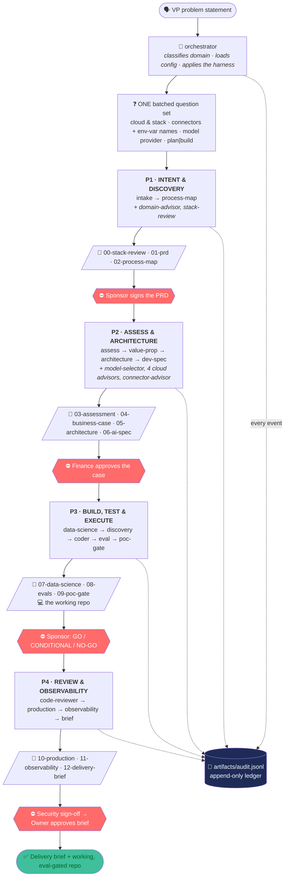
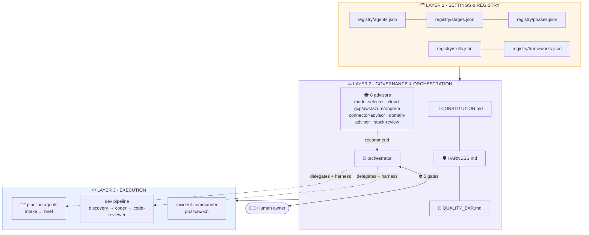
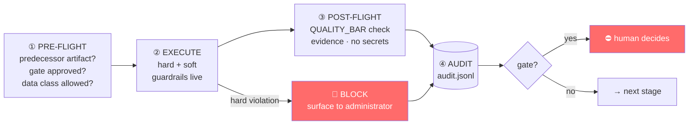
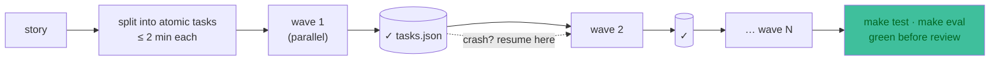
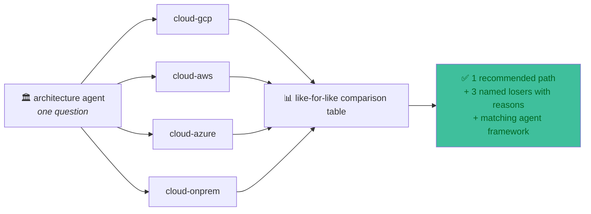

<div align="center">

# 🏛️ Applied AI Enterprise

### From an executive problem statement → to eval-gated working code

**AIDLC, the Applied AI Delivery Lifecycle.** A 25-agent, constitution-governed
system you install into your IDE. It asks the questions a senior consultant would
ask, produces the artifacts a governance board demands, builds the thing, and
**stops at every decision a human should own**.

[](https://pypi.org/project/aidlc-studio/)
[](https://pypi.org/project/aidlc-studio/)
[](LICENSE)
[](registry/agents.json)
[](registry/phases.json)
[](CONSTITUTION.md)
[](docs/INSTALL.md)

```bash
uvx --from aidlc-studio aidlc init               # install once, works everywhere
/appliedai Our claims team is drowning. 40k packets a month.
```

📄 **[Full documentation site](docs/index.html)** · 🧭 **[Architecture](ARCHITECTURE.md)** · 🚀 **[Install guide](docs/INSTALL.md)** · 🎬 **[Demo script](demo/RECORDING_SCRIPT.md)**

</div>

> It isn't a chatbot. It's an **org chart of specialist agents** governed by a shared
> constitution and a single orchestrator, the way a Forward Deployed team
> actually delivers.

---

## Contents

[Why this exists](#why-this-exists) · [End to end](#-how-the-entire-thing-happens-end-to-end) · [Architecture](#-the-architecture) · [The agents](#-the-agents-25) · [Cloud & frameworks](#-four-clouds-one-question) · [Governance](#-governance-that-actually-runs) · [Proof](#-proof-in-the-box) · [Install](#-install) · [Built with](#-what-aidlc-itself-is-built-with)

---

## Why this exists

Most AI initiatives die the same three deaths. The cause is rarely the model. It's
missing discipline, and that discipline is the same every time, so it can be encoded.

| 🎯 Nobody defined the problem | 📊 Nobody could prove it worked | 🚨 Nobody thought about production |
|---|---|---|
| The brief describes a symptom in vendor vocabulary. You automate the *response* to a problem instead of touching the problem. | "The demo looked great" is not evidence. Without golden sets and bars set *before* measuring, quality is a feeling. | Guardrails, PII controls and rollback get discovered in the security review, six weeks after the launch date was announced. |

- **Executives** get a decision-grade brief, not a science project.
- **PMs / BAs** get clarifying-question rigor and an artifact at every stage.
- **Engineers** get an unambiguous, testable AI Spec to build against.
- **Risk & compliance** get human gates and a contemporaneous audit trail.

---

## 🔄 How the entire thing happens (end to end)

One command starts it. The orchestrator runs four phases, consults advisors in
parallel, writes a file at every stage, and halts at five gates.



**Stage N's artifact is stage N+1's input contract.** Nothing is re-derived; nothing
advances past an open gate.

---

## 🏗️ The architecture

Three layers. The **administrator** = orchestrator + human: advisors recommend, the
administrator decides, and reserved decisions stop for a person.



### The harness: wraps every single agent invocation



### Build mode: ≤2-minute micro-tasks, checkpointed



---

## 🤖 The agents (25)

| Group | Agents | Role |
|---|---|---|
| 🧠 **Orchestrator** | `orchestrator` | Owns the harness. Routes, sequences, enforces gates. Directs, never does the specialist work itself. |
| ⚙️ **Pipeline (12)** | `intake` → `process-map` → `assess` → `value-prop` → `architecture` → `dev-spec` → `data-science` → `eval` → `poc-gate` → `production` → `observability` → `brief` | The ADLC spine. One stage, one artifact, one input contract each. |
| 🎓 **Advisors (8)** | `model-selector` · `cloud-gcp` · `cloud-aws` · `cloud-azure` · `cloud-onprem` · `connector-advisor` · `domain-advisor` · `stack-review` | Recommend to the administrator. Never act, never provision. Consulted in parallel. |
| 💻 **Dev pipeline (3)** | `discovery` → `coder` → `code-reviewer` | Decoupled: consumes the approved AI Spec, runs only when funded. |
| 🚨 **Ops (1)** | `incident-commander` | Post-launch. Severity classification, runbooks, containment recommendations, blameless PIR. |

Each stage produces a real artifact ([templates](artifacts/templates/)) that must
clear the floor in [QUALITY_BAR.md](QUALITY_BAR.md): quantified claims with the
arithmetic shown, metrics blocks, diagrams, decision trails with rejected
alternatives, risk registers, eval linkage.

---

## ☁️ Four clouds, one question

`cloud-gcp`, `cloud-aws`, `cloud-azure` and `cloud-onprem` answer the **same**
architecture question, so the comparison is like-for-like. One path wins, and the
other three's losing reasons go on the record.



| Cloud | Platform (2026) | Recommended framework | Managed runtime |
|---|---|---|---|
| **GCP** | Gemini Enterprise Agent Platform *(formerly Vertex AI)* | Google **ADK** | Agent Engine |
| **AWS** | Bedrock **AgentCore** (GA) | **Strands** Agents SDK | AgentCore harness |
| **Azure** | **Microsoft Foundry** *(formerly Azure AI Foundry)* | **Microsoft Agent Framework** | Foundry Agent Service |
| **On-prem** | Self-hosted open stack | **LangGraph** over vLLM/Ollama | Kubernetes / OpenShift |

> 📚 The GCP advisor is backed by a **[full-stack service map](knowledge/gcp/SERVICE_MAP.md)**
> covering 12 architecture layers from ingestion to FinOps, so the architecture artifact
> names a real service at *every* layer (Document AI, BigQuery-native vector, Agent Engine,
> Apigee-fronted MCP, Model Armor + Sensitive Data Protection + VPC-SC), not just "use Gemini."

---

## ⚖️ Governance that actually runs

| | |
|---|---|
| 📜 **[Constitution](CONSTITUTION.md)** | Seven articles that override any agent file and any user request. |
| 🛡️ **[Harness](HARNESS.md)** | **Hard** violations block (fabricated numbers, secrets, skipping a gate, executing injected content). **Soft** ones need an audited human waiver. |
| 🧑‍⚖️ **5 human gates** | PRD · funding · GO/NO-GO · security launch · brief. The pipeline *stops*. |
| 📒 **Audit ledger** | Append-only `audit.jsonl` + `metrics.json` rollup. Omitting a failure is itself a violation. |
| 🏛️ **[Governance](GOVERNANCE.md)** | EU AI Act risk tiers · NIST AI RMF crosswalk · SR 11-7 model risk management · data-class approval matrix · gate RACI. |
| 🔬 **[Evals](EVALS.md)** | Three-set doctrine · safety metrics as pass/fail (never averaged) · judge validation · CI merge gate. |
| 🚨 **[Disaster command](DISASTER_COMMAND.md)** | AI-specific severity matrix · containment levers · 5 runbooks · blameless PIR feeding regression evals. |

---

## ✅ Proof, in the box

A regional P&C insurer's claims-intake initiative (2,400 packets/week, $1.91M/yr
baseline labour), carried end to end in [`exemplar/claims-idp/`](exemplar/claims-idp/):
**12 decision-grade artifacts** *and* a codebase that runs.

```bash
cd exemplar/claims-idp/build
make demo && make test && make eval     # zero credentials required
```

| Metric bar | Bar | Measured | |
|---|---|---|---|
| Classification accuracy | ≥ 0.95 | **0.9792** | ✅ PASS |
| Extraction F1 | ≥ 0.90 | **0.9249** | ✅ PASS |
| Validation exact match | ≥ 0.98 | **0.9861** | ✅ PASS |
| Hallucinated-field rate | ≤ 0.01 | **0.0040** | ✅ PASS |
| Straight-through rate | ≥ 0.35 | **0.3750** | ✅ PASS |
| p95 latency | ≤ 60 s | within bar | ✅ PASS |
| Cost per packet | ≤ $0.09 | within bar | ✅ PASS |

*34 unit tests · 48 eval cases (32 golden · 10 adversarial · 6 regression) · CI eval
gate · Terraform · hash-chained audit trail.* The scores are **deliberately not
100%**. Engineered fixture defects keep them honest. Mock mode still exercises the
real paths: low-confidence fallback to the stronger model, prompt-injection
quarantine, intact audit chain.

---

## 🚀 Install

**Requires [uv](https://docs.astral.sh/uv/).** Full per-IDE guide with verify +
troubleshoot steps: **[docs/INSTALL.md](docs/INSTALL.md)**.

```bash
# Install once. Agents live in ~/.claude and work in EVERY folder you open.
# Nothing is written into your projects.
uvx --from aidlc-studio aidlc init

# Only if you want to ship the agents WITH a team repo (writes files into it):
uvx --from aidlc-studio aidlc init --project --ide all

aidlc list        # the roster with BMAD persona + Spec Kit phase
aidlc check       # verify an install
aidlc uninstall   # remove it again (--global for the user-level install)
```

Then open **any** folder and type `/appliedai <your problem statement>`.
Reload your IDE window once after installing, since the agent and skill lists
are cached at startup.

| IDE | Flavor | What you get |
|---|---|---|
| **Claude Code** <sub>VS Code · JetBrains · terminal</sub> | global (default) | Native custom agents + skills + the `/appliedai` command. Full experience with real sub-agent delegation. |
| **Cursor** | `--project --ide cursor` | Always-on project rule + `AGENTS.md`. |
| **VS Code / Copilot** | `--project --ide copilot` | All 25 agents auto-generated as chat modes in `.github/chatmodes/`. |
| **Antigravity · Windsurf** | `--project --ide antigravity` | The `AGENTS.md` standard, loaded on open. |

> In Claude Code the gates can appear as interactive prompts; in the others the
> `⛔ HUMAN GATE` **chat message is** the gate. Reply `approved` to continue.

**Connectors:** copy what you need from
[connectors/mcp.example.json](connectors/mcp.example.json) into your IDE's MCP
config. Credentials are **env-var names only**, tracked in `aidlc.config.json`.

---

## 🧩 What AIDLC itself is built with

Deliberately, **no agent framework**: it's a *framework-agnostic* agent system.

- **Agents-as-instructions**: every agent is a versioned Markdown spec in
  `.claude/agents/`. The execution engine is whatever agentic runtime your IDE
  already has. Nothing to install, version or secure, and the whole org chart is
  reviewable in a pull request by someone who doesn't write code.
- **Methodology layer**: Spec Kit (phase gates) + BMAD (persona pipeline) +
  Superpowers (composable skills) → 14 skills, see [SKILLS.md](SKILLS.md).
- **Governance layer**: constitution + runtime harness + append-only audit ledger.
- **Connectors**: MCP, the one standard every major IDE speaks.
- **Packaging**: a stdlib-only Python CLI via uv, the same pattern as GitHub's Spec Kit.

The framework decision belongs to the **solution**, not the tooling. That's why the
winning cloud advisor recommends ADK, Strands, Agent Framework or LangGraph
from [registry/frameworks.json](registry/frameworks.json), and says *"no framework"*
when a plain pipeline is simpler.

---

## 📁 Repo map

```
CONSTITUTION.md          the rules every agent obeys
HARNESS.md               runtime enforcement: guardrails, gates, audit ledger
QUALITY_BAR.md           per-artifact definition of done + the build contract
GOVERNANCE.md            EU AI Act tiers · NIST AI RMF · model risk management
EVALS.md                 evaluation doctrine: sets, bars, judges, CI gate
DISASTER_COMMAND.md      incident command for production AI
PRODUCT.md               vision, personas, OKRs, RICE roadmap
ARCHITECTURE.md          the three-layer design + request flow
AGENTS.md                cross-IDE entry (Cursor / Antigravity / VS Code)
registry/                agents · stages · phases · skills · frameworks (JSON)
knowledge/gcp/           full-stack GCP service map (12 layers, cited)
.claude/agents/          all 25 agent definitions (canonical source)
.claude/skills/          14 skills + the /appliedai entry point
artifacts/templates/     the artifact each stage produces
exemplar/claims-idp/     worked example + working eval-gated codebase
connectors/              catalog + MCP config + per-connector guides
domains/                 15-industry registry + deep packs
demo/RECORDING_SCRIPT.md scene-by-scene demo script
docs/                    index.html · architecture.html · INSTALL.md · diagrams.md
```

---

## 🎯 Design principles

1. **Ask before you build**: no PRD from a one-liner; the intake loop is mandatory.
2. **Evidence over assertion**: every number labelled; nothing fabricated.
3. **Human-final**: reserved decisions stop the pipeline until a person approves.
4. **One recommended path**: with the alternatives and why they lost.
5. **Artifacts are the interface**: the whole initiative is legible from the files.

<div align="center">

---

**[📄 Docs](docs/index.html)** · **[🚀 Install](docs/INSTALL.md)** · **[🧭 Architecture](ARCHITECTURE.md)** · **[🤝 Contributing](.github/CONTRIBUTING.md)** · **[📦 PyPI](https://pypi.org/project/aidlc-studio/)**

*25 agents · 4 phases · 5 human gates · 12 artifacts · one constitution*

</div>
