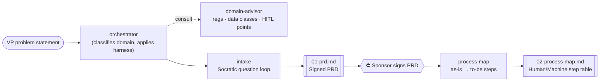
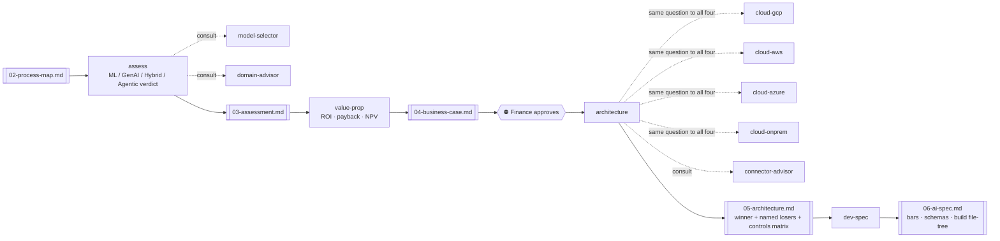
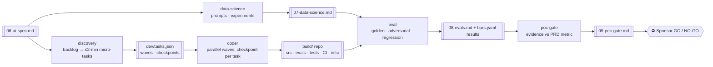
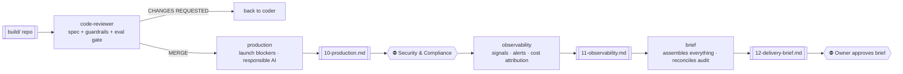
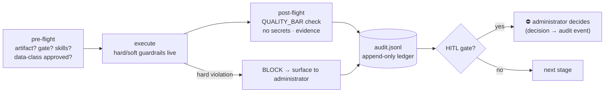
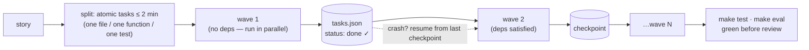
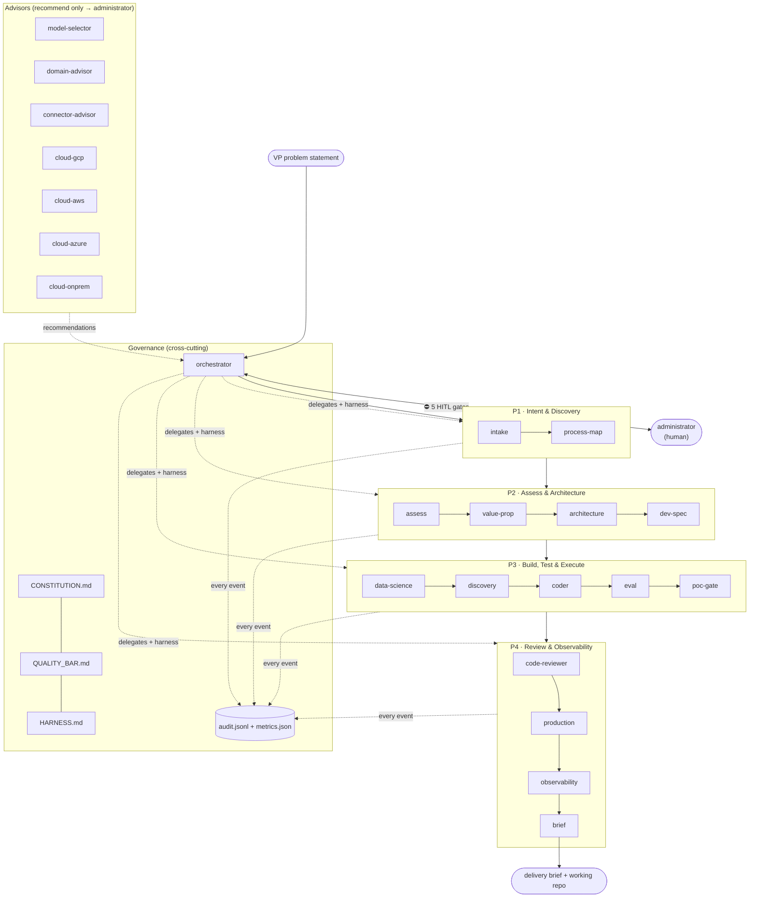

# AIDLC — Component Diagrams

Each component individually, then the complete connection map. (Mermaid — renders
on GitHub and in most IDEs.) Machine-readable phase map: `registry/phases.json`.

---

## P1 · Intent & Discovery

## P2 · Assess & Architecture

## P3 · Build, Test & Execute

## P4 · Review & Observability

## The harness (wraps every invocation above)

## The micro-task engine (inside P3)

## Complete connection map

