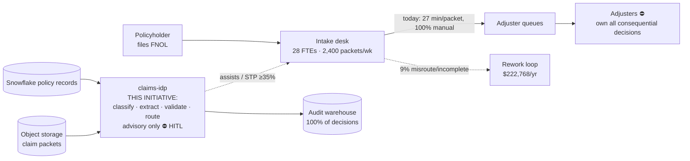

# PRD — FNOL Claims Intake Intelligent Document Processing (claims-idp)

> Stage 1 · Owner: intake agent · Status: ☑ **SIGNED** by R. Vance, VP Claims Operations, on 2026-07-14
> Client: Meridian Mutual, regional P&C carrier (auto + property lines, 4-state footprint)
> Every field traces to a stakeholder answer or is flagged `[assumption — confirm]`.

## Problem statement

Meridian Mutual's first-notice-of-loss (FNOL) intake desk receives **2,400 claim
packets per week = 124,800/yr `[stated]`** — mixed-media bundles containing claim
forms, damage photos, scanned police reports, and medical bills. **28 intake FTEs
`[estimated]`** manually open each packet, classify every attachment, key fields
into the claims platform, verify them against policy records in Snowflake, and
route the claim to an adjuster queue. A clean packet takes **22 min `[stated]`**;
a messy one (skewed scans, handwriting, missing pages) takes **40+ min `[stated]`**;
the blended average is **27 min `[stated]`**. That is a baseline labor cost of
**124,800 packets × 0.45 hr × $34/hr loaded `[estimated]` ≈ $1.91M/yr**
(exact: $1,909,440). On top of labor, **9% of packets `[stated]`** are misrouted or
flagged incomplete downstream, forcing rework loops that adjusters feel as delayed
cycle time and policyholders feel as silence during the worst week of their year.
Straight-through processing today is **0%** — every packet is touched by a human,
including the two-thirds that are routine.

## Success metric

| Metric | Baseline | Target | Measured | How measured | Owner | By when |
|--------|----------|--------|----------|--------------|-------|---------|
| Avg intake handle time / packet | 27 min `[stated]` | ≤12 min on assisted packets | — (stage 8) | Claims platform timestamps, weekly report | Intake Ops Manager (D. Reyes) | Q4 2026 |
| Misroute / incomplete rate | 9% `[stated]` | ≤4% | — (stage 8) | Downstream rework queue count ÷ weekly volume | Claims QA Lead (S. Whitfield) | Q4 2026 |
| Straight-through processing (STP) | 0% `[stated]` | ≥35% | — (stage 8) | Packets closed intake→queue with zero human touches ÷ volume | Intake Ops Manager | Q4 2026 |
| Audit coverage of IDP calls/decisions | 0% (no IDP exists) | 100% | — (stage 8) | AuditRecord rows in BigQuery ÷ IDP invocations (must equal 1.0) | Compliance Officer (T. Okafor) | Q4 2026 |
| Cost per processed packet (AI path) | n/a | ≤$0.09; expect $0.048 `[estimated]` | — (stage 8) | Billing export ÷ packet count, monthly | Platform Eng Lead (J. Iyer) | Q4 2026 |
| p95 IDP latency per packet | n/a | ≤60 s | — (stage 8) | Cloud Trace percentile, per-packet span | Platform Eng Lead | Q4 2026 |

**Eval linkage:** every target above becomes a metric bar in `06-ai-spec.md` §7
and is measured by the stage-8 eval harness (`evals/run_evals.py` against
`evals/bars.yaml`). No bar here exists without an eval that proves it.

## Context (where the initiative sits)

## Volumetrics

| Dimension | Value | Label | Source |
|-----------|-------|-------|--------|
| Packets / week | 2,400 | `[stated]` | R. Vance, kickoff 2026-07-08 |
| Packets / yr | 124,800 (2,400 × 52) | `[stated]` | derived |
| Attachments / packet (avg) | 6.2 (range 2–19) | `[estimated]` | D. Reyes, sample of 200 packets |
| Pages / packet (avg) | 10.4 | `[estimated]` | same 200-packet sample |
| Media mix | 41% forms · 27% photos · 18% police reports · 14% medical bills | `[estimated]` | same sample |
| "Messy" share (scans/handwriting) | ~30% of packets | `[estimated]` | D. Reyes; drives 40+ min tail |
| Peak week (CAT event) | up to 3.9× baseline ≈ 9,400 packets | `[stated]` | 2025 hail-season peak, ops report |
| Intake FTEs | 28 | `[estimated]` | HR headcount, confirm exact split |

## Current-cost model (arithmetic shown)

| Driver | Math | Annual cost | Label |
|--------|------|-------------|-------|
| Intake labor | 124,800 × 0.45 hr × $34/hr | $1,909,440 | `[estimated]` (rate), `[stated]` (time, volume) |
| Misroute rework | 124,800 × 9% = 11,232 packets × 35 min (0.583 hr) × $34 | $222,768 | `[estimated]` (rework time) |
| CAT-season overtime | ~2,100 OT hrs × $51/hr (1.5×) | $107,100 | `[estimated]` |
| **Total status quo** | — | **≈ $2.24M/yr** | mixed, per rows above |

## Scope

- **In scope (first slice):** auto and property FNOL packets arriving via the
  existing intake mailbox/portal upload; classification, field extraction,
  policy-record validation against Snowflake, confidence-gated routing to
  adjuster queues; 100% audit logging; adjuster-facing review UI hooks.
- **Out of scope (explicit):**
  1. Coverage decisions or denials of any kind — the system is **advisory only** `[stated]`, non-negotiable.
  2. Fraud scoring (fraud-signal source is TBD; parked to phase 2 — see Open Q3).
  3. Subrogation, litigation, and workers'-comp lines.
  4. Direct policyholder-facing chat or status communication.
  5. Changes to the adjuster queue taxonomy itself (we route into it, we don't redesign it).
  6. Handwriting-only packets below OCR confidence floor — routed to human, not "solved."

## Users & the moment of use

| User | Moment | Tool surface |
|------|--------|--------------|
| Intake specialist (28 FTEs) | Opens a pre-processed packet: fields pre-filled, confidence flags visible; corrects instead of keys | Claims platform intake screen (embedded panel) |
| Adjuster (~110) | Receives routed claim with extraction summary + provenance links | Adjuster queue |
| Claims QA lead | Samples STP packets and reviews exception queue daily | QA dashboard (BigQuery-backed) |
| Compliance officer | Pulls complete decision trail for any claim on demand | BigQuery audit warehouse |

## Data sources (named; depth deferred to stage 3)

| System | Owner | Contents | Volume | Labelled? |
|--------|-------|----------|--------|-----------|
| Object storage (claim-packet bucket) | Platform Eng (J. Iyer) | All packet attachments (PDF, JPEG, TIFF) | ~1.3M pages/yr | No — ground truth to be built (stage 3) |
| Snowflake `POLICY_DB` | Data Eng (M. Chen) | Policy records: policy no., insured, coverages, effective dates | ~410K active policies `[estimated]` | Structured, authoritative |
| Fraud signals | **TBD** `[stated]` | Vendor undecided | — | Out of scope until source named |

## Non-negotiables & constraints

- **Regulatory:** packets contain **PII and PHI** (medical bills) `[stated]`. Audit
  logging of every IDP call and decision is **mandatory** `[stated]`. State DOI
  market-conduct exams can demand the full decision trail for any claim.
- **HITL:** adjusters own **all consequential decisions** `[stated]`. No autonomous
  coverage denial, ever — system output is advisory. HITL points are fixed in
  `02-process-map.md` and enforced in code.
- **Latency:** p95 ≤60 s/packet end-to-end (intake SLA is "queue within the hour";
  60 s leaves headroom for retries and CAT surge).
- **Cost ceiling:** ≤$0.09/packet all-in inference+OCR `[stated bar]`.
- **Timeline:** production by **Q4 2026** `[stated]`.
- **Residency:** US regions only `[assumption — confirm]` (no data-sovereignty
  mandate identified beyond US processing).

## Decision trail

| Decision | Chosen | Rejected | Why | Approved by |
|----------|--------|----------|-----|-------------|
| First slice | FNOL intake (classify + extract + validate + route) | Full claims adjudication assist | Intake is high-volume, low-consequence-per-decision, measurable; adjudication is regulated judgement | R. Vance, 2026-07-10 |
| Autonomy level | Advisory + confidence-gated STP for routing only | Any autonomous coverage action | Regulatory posture; adjusters legally accountable | R. Vance + T. Okafor, 2026-07-10 |
| Lines in scope | Auto + property | + workers' comp | WC adds heavier PHI handling and a different intake flow; phase 2 | R. Vance, 2026-07-14 |
| Success framing | STP% + misroute% + handle time | "Adjuster satisfaction" survey as primary | Survey isn't attributable or eval-able; kept as secondary signal | Intake agent proposal, accepted by D. Reyes |

## Risk register

| # | Risk (this use case) | Sev (1–5) | Lik (1–5) | S×L | Mitigation | Owner |
|---|----------------------|-----------|-----------|-----|------------|-------|
| R1 | Extraction errors on medical bills propagate PHI mistakes into claim records → DOI finding | 5 | 3 | 15 | Field-extraction F1 ≥90% bar + hallucinated-field <1% hard gate + human review below confidence threshold | S. Whitfield |
| R2 | CAT-week surge (3.9×) blows the p95 ≤60 s envelope and the queue backs up | 4 | 3 | 12 | Autoscaling serving tier sized to 4× baseline; batch-degrade mode drops to async with SLA alarm | J. Iyer |
| R3 | STP target (≥35%) missed because messy-packet share is higher than the 30% sample suggests | 3 | 3 | 9 | Stage-3 data-readiness audit on 1,000-packet stratified sample before bars are locked | Assess agent → D. Reyes |
| R4 | 28 intake FTEs perceive the project as headcount elimination → sabotage/attrition before go-live | 4 | 3 | 12 | Reframe as CAT-surge capacity + redeploy plan; intake specialists staff the exception queue; comms owned by ops | R. Vance |
| R5 | Snowflake policy-record latency or access model blocks the ≤60 s envelope | 3 | 2 | 6 | Validate connector p95 in stage 5; cache read-only policy snapshot if needed | M. Chen |
| R6 | Ground-truth labelling (none exists today) slips and stalls stage 8 | 4 | 3 | 12 | Labelling starts stage 3, 500 packets dual-annotated; budgeted in business case | Assess agent → S. Whitfield |

## Assumptions & open questions

1. `[assumption — confirm]` Loaded rate $34/hr is the blended intake rate; HR to confirm by 2026-07-28.
2. `[assumption — confirm]` 28 FTEs are 100% allocated to intake (not split with other queues).
3. **Open:** fraud-signal source — vendor vs internal model — must be named before phase 2 scoping.
4. `[assumption — confirm]` US-only residency suffices; no state requires in-state processing.
5. **Open:** exact CAT-surge SLA relaxation policy (is 60 s still binding at 3.9× volume, or does async mode satisfy the SLA?). D. Reyes to rule by stage 5.
6. `[assumption — confirm]` 6.2 attachments and 10.4 pages/packet from the 200-packet sample generalize; stage-3 1,000-packet audit will confirm.

## Sign-off (HITL gate)

- Sponsor: **R. Vance, VP Claims Operations** — signed 2026-07-14 → unlocks stage 2.
- Compliance concurrence: **T. Okafor** — signed 2026-07-14 (advisory-only + audit mandate recorded).

## Handoff to stage 2 (process-map)

**You consume:** the volumetrics table, the current-cost model, the H/M boundary
constraints (advisory only; adjusters own consequential decisions), and the six
metric bars above — your to-be flow must show where each bar is won or lost.
**Still open for you:** items 5 and 6 above; map the CAT-surge path explicitly as
an alternate flow, and tag every step Human/Machine so stage 3 can score seams.
