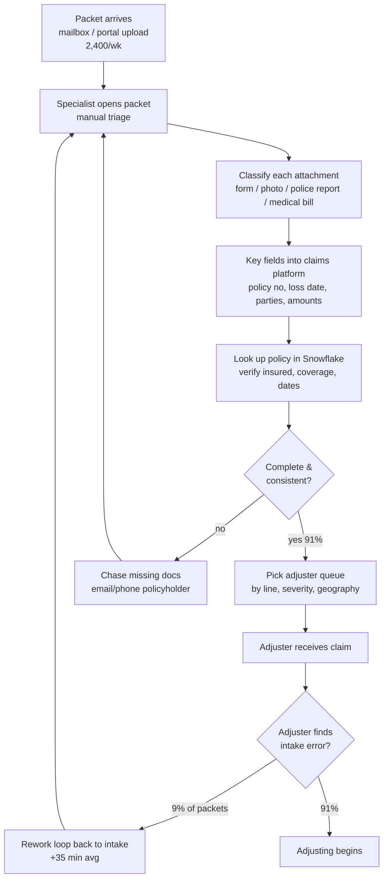
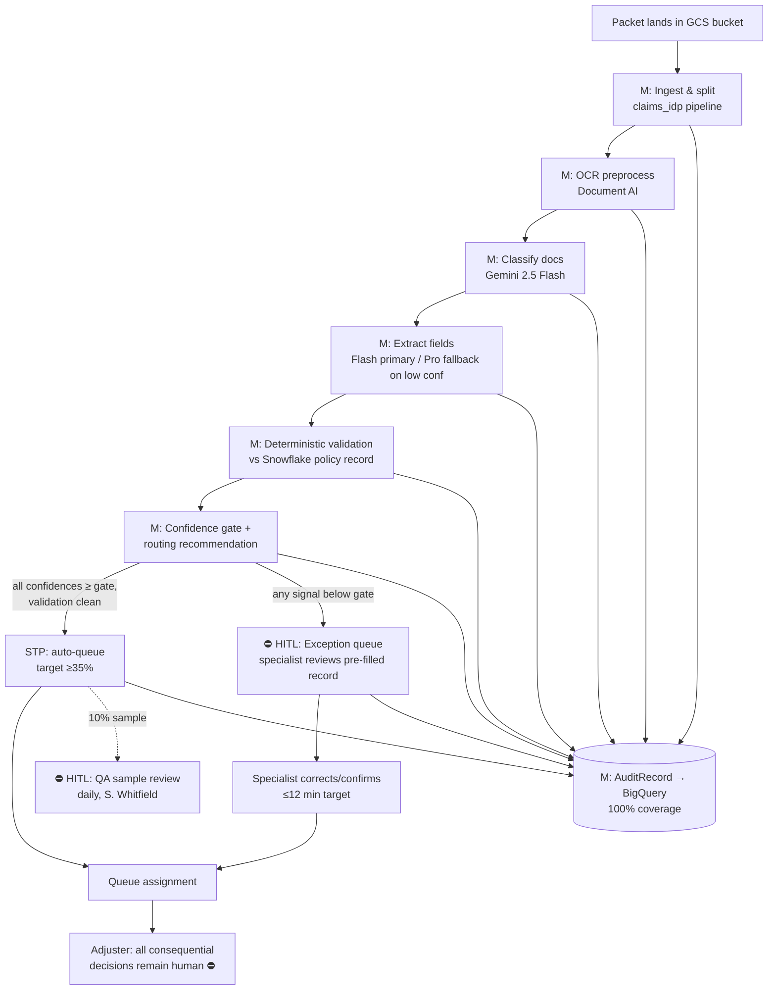

# Process Map — FNOL Claims Intake IDP (claims-idp)

> Stage 2 · Owner: process-map agent · Input: 01-prd.md (SIGNED 2026-07-14)
> All volumes/times inherit labels from the PRD; new figures labelled here.

## As-is flow (mermaid)

## As-is step table

| # | Step | Actor / system | Input → action → output | Time · cost · volume | Error rate | **H/M** |
|---|------|----------------|-------------------------|----------------------|-----------|---------|
| 1 | Receive & open packet | Intake specialist / mailbox+portal | Raw packet → open, eyeball → working set | 2 min `[estimated]` · 124,800/yr | Dup/missing packet ~1% `[estimated]` | H |
| 2 | Classify attachments | Specialist (eyes only) | 6.2 attachments avg → label each → mental doc map | 4 min `[estimated]` | Mislabel ~3% `[estimated]`, worse on scans | H |
| 3 | Key fields | Specialist / claims platform | Docs → transcribe ~24 fields → intake record | 11 min clean / 22+ messy `[estimated]` | Keying error 2–4% `[estimated]` | H |
| 4 | Policy validation | Specialist / Snowflake lookup UI | Keyed fields → match policy, check coverage window → verified/flagged | 4 min `[estimated]` | Miss on name variants ~2% `[estimated]` | H |
| 5 | Completeness check & chase | Specialist / email, phone | Record → gap check → chase or proceed | 3 min + open loop days | Chase needed ~14% of packets `[estimated]` | H |
| 6 | Route to queue | Specialist / claims platform | Verified record → queue pick → assignment | 3 min `[estimated]` | **Misroute contributes to the 9% `[stated]`** | H |
| 7 | Downstream rework | Adjuster → specialist | Bad record → bounce-back → re-key | 35 min `[estimated]` × 11,232/yr = $222,768 | — | H |

Row check: steps 1–6 ≈ 27 min blended, matching the PRD's stated average.

## Seam analysis (automation candidates, ranked)

| Machine-taggable step | Volume touched | Pain ($/yr) | Feasibility | Rank | Rationale |
|-----------------------|----------------|-------------|-------------|------|-----------|
| 3 Field extraction | 100% packets | ~$778K (11 of 27 min) `[estimated]` | High — multimodal GenAI proven on forms/bills | **1** | Biggest single time block; measurable F1 |
| 2 Attachment classification | 100% packets | ~$283K (4 min) `[estimated]` | High — closed label set of 4+1 classes | **2** | Prerequisite for extraction routing |
| 4 Policy validation | 100% packets | ~$283K (4 min) `[estimated]` | High — deterministic join vs Snowflake | **3** | Rules, not ML: exact-match checkable ≥98% |
| 6 Queue routing | 100% packets | ~$212K + rework share | Medium — needs confidence gating | **4** | Advisory routing with STP only above threshold |
| 5 Completeness chase | 14% packets | Cycle-time pain (days) | Medium | 5 | Auto-draft chase list; human sends (phase 1) |
| 1 Receive & open | 100% | ~$141K | High — trivial ingestion | 6 | Comes free with pipeline ingestion |

## To-be flow (mermaid, HITL points marked)

## To-be step table

| # | Step | New actor (H/M) | **HITL point?** | Note |
|---|------|-----------------|-----------------|------|
| 1 | Ingest, split, hash packet | M | — | Dedup by content hash; kills as-is step-1 dup errors |
| 2 | OCR preprocessing | M (Document AI) | — | Normalizes the 30% messy tail before the LLM sees it |
| 3 | Document classification | M (Gemini 2.5 Flash) | — | Bar: accuracy ≥95% (spec §7) |
| 4 | Field extraction | M (Flash → Pro fallback) | — | Bar: F1 ≥90%; hallucinated-field <1% hard gate |
| 5 | Policy validation | M (deterministic, Snowflake) | — | Bar: exact-match ≥98%; **not** an LLM step by design |
| 6 | Confidence gate + routing rec | M | — | Emits RoutingDecision with per-field confidence |
| 7 | STP auto-queue (clean only) | M | ⛔ 10% daily QA sample (H) | STP is routing only — never a coverage action |
| 8 | Exception review | **H** (specialist) | ⛔ human confirms every exception packet | Pre-filled record; target ≤12 min |
| 9 | Adjuster decisions | **H** (adjuster) | ⛔ all consequential decisions | Advisory-only mandate from PRD carried verbatim |
| 10 | Audit write | M (BigQuery) | — | 100% of calls/decisions; compliance-owned schema |

## What must stay human — and why

- **Every coverage-consequential decision (step 9)** — regulatory accountability;
  PRD non-negotiable; no autonomous denial under any confidence level.
- **Exception-queue confirmation (step 8)** — below-gate extractions carry PII/PHI
  risk (risk R1); a human signs every record the machine wasn't sure about.
- **QA sampling of STP packets (step 7)** — the STP lane has no per-packet human;
  the 10% daily sample is the control that keeps it honest and feeds regression evals.
- **Policyholder chase communications (step 5 as-is)** — drafted by machine in a
  later phase, sent by humans; empathy and liability both argue for it.

## Metrics block (traceable to PRD)

| Metric | Baseline (as-is) | Target (to-be) | Measured | Method | Owner |
|--------|------------------|----------------|----------|--------|-------|
| Handle time, exception packets | 27 min `[stated]` | ≤12 min | — (stage 8) | Platform timestamps, steps 8→9 | D. Reyes |
| Human touches per STP packet | ≥1 (100% touched) | 0 (+ sampled QA) | — (stage 8) | Touch-event count in audit log | D. Reyes |
| Misroute/incomplete | 9% `[stated]` | ≤4% | — (stage 8) | Rework-queue inflow ÷ volume | S. Whitfield |
| Rework loop cost | $222,768/yr `[estimated]` | ≤$99K/yr (at 4%) | — (stage 8) | 124,800 × rate × 0.583 hr × $34 | Value-prop agent |
| Audit coverage | 0% | 100% | — (stage 8) | AuditRecords ÷ pipeline invocations = 1.0 | T. Okafor |

## Decision trail

| Decision | Chosen | Rejected | Why | Approved by |
|----------|--------|----------|-----|-------------|
| Validation approach (step 5) | Deterministic rules vs Snowflake | LLM-judged validation | Policy matching is exact-match checkable; LLM adds hallucination surface for zero benefit | Process-map agent; ratified by assess (stage 3) |
| STP definition | Routing-only auto-queue above gate | STP including auto-acknowledgement letters | Letters are policyholder-facing → out of PRD scope | D. Reyes, 2026-07-16 |
| Exception staffing | Existing intake specialists staff exception queue | New dedicated review team | Preserves domain knowledge, answers risk R4 (workforce fear) | R. Vance, 2026-07-16 |
| QA sample rate | 10% of STP daily | 2% | Until stage-8 evidence exists, sample must be large enough to detect a 1-pt misroute drift within a week (≈600 packets/wk sampled) | S. Whitfield, 2026-07-16 |

## Risk register

| # | Risk | Sev | Lik | S×L | Mitigation | Owner |
|---|------|-----|-----|-----|------------|-------|
| R1 | Confidence gate tuned too loose → bad packets enter STP lane silently | 5 | 3 | 15 | Gate thresholds set from stage-8 eval curves, not intuition; 10% QA sample; drift alarm on sample error rate | S. Whitfield |
| R2 | Gate tuned too tight → STP <35% and business case erodes | 3 | 3 | 9 | Bar has explicit sensitivity in stage 4; per-field (not per-packet) gating recovers marginal packets | Data-science agent |
| R3 | Exception queue becomes a new bottleneck during CAT surge | 4 | 3 | 12 | Surge playbook: overflow specialists + relaxed async SLA (open Q5 from PRD) | D. Reyes |
| R4 | Snowflake validation join misses name/address variants → false "mismatch" exceptions | 3 | 3 | 9 | Normalization rules + fuzzy-assist suggestions (human confirms); measured inside the ≥98% bar | M. Chen |
| R5 | Audit write failure silently drops records → 100% coverage claim false | 5 | 2 | 10 | Audit write is transactional with the pipeline step; failed write = failed packet (blocks STP) | J. Iyer |

## Assumptions & open questions

1. `[assumption — confirm]` Per-step as-is timings (2/4/11/4/3/3 min) allocated from the 27-min blended average by D. Reyes's estimate; 1,000-packet time study in stage 3 will refine.
2. `[assumption — confirm]` Exception-queue share ≈ 65% at launch (1 − 35% STP); staffing model in stage 4 uses this.
3. **Open (inherited PRD Q5):** CAT-surge SLA policy — blocks final gate design for step 7.
4. `[assumption — confirm]` Claims platform can accept queue assignments via API (not screen-scrape); connector check in stage 5.

## Handoff to stage 3 (assess)

**You consume:** the seam ranking (extraction #1, classification #2, validation #3,
routing #4), the H/M boundary table, and the to-be flow's confidence-gate design.
**Your job:** score ML vs GenAI vs Hybrid vs Agentic against ≥5 criteria for
*these four seams specifically*; note that step 5 is already ruled deterministic —
challenge it only with evidence. **Still open for you:** ground-truth inventory
(none exists), data-readiness on the 30% messy tail, and assumptions 1–2 above.
