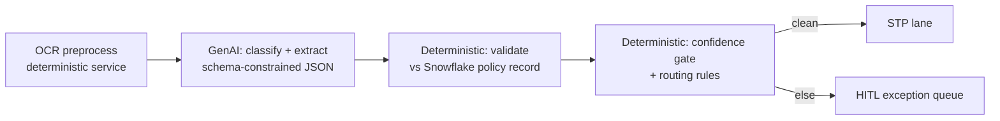

# Technical Assessment — FNOL Claims Intake IDP (claims-idp)

> Stage 3 · Owner: assess agent · Input: 02-process-map.md
> Consulted: model-selector, domain-advisor, cloud-gcp/aws/azure/onprem (quick pass)

## Verdict: should this be AI?

**Yes — HYBRID.** GenAI multimodal extraction where the input is unstructured
(photos, scans, handwriting), deterministic code where the check is exact
(policy validation, routing rules), and confidence gating stitching the two.
Pure rules cannot read a water-damaged scanned police report; pure GenAI must
never be the thing that decides whether a policy number matches Snowflake.

## Solution-type verdict matrix

Scored 1–5 per criterion (5 = best fit for this use case). Weights reflect PRD
non-negotiables (regulated data, Q4 timeline, $0.09/packet bar).

| Criterion (weight) | Classical ML | GenAI-only | **Hybrid** | Agentic |
|---|---|---|---|---|
| Handles unstructured multimodal input — photos, scans, handwriting (×3) | 2 — needs per-doc-type training sets that don't exist | 5 | **5** | 5 |
| Determinism where regulators look — validation, routing, audit (×3) | 4 | 2 — validation via LLM adds hallucination surface | **5** — validation is code | 2 — emergent tool paths hurt reproducibility |
| Time-to-production by Q4 2026 (×2) | 2 — label-collect-train cycle per doc type | 4 | **4** | 2 — orchestration + safety casework balloons |
| Cost per packet vs $0.09 bar (×2) | 4 — cheap inference, expensive build | 3 — Pro-class on everything overshoots | **5** — Flash primary, Pro only on the messy tail | 2 — multi-step tool loops multiply calls |
| Auditability / explainability of each decision (×2) | 4 | 3 | **5** — every gate & rule logged; LLM output schema-constrained | 2 |
| Failure-mode blast radius under HITL mandate (×2) | 3 | 3 | **4** — worst case is a false exception (human catches) | 2 — worst case is an unplanned action chain |
| Maintainability by a 5-person team (×1) | 3 | 4 | **4** | 2 |
| **Weighted total (max 75)** | **46** | **51** | **70** | **36** |

**Rejected — Agentic (36):** unearned complexity. The to-be flow is a fixed
pipeline with two branch points; nothing requires dynamic tool selection or
multi-step planning. Agentic autonomy also collides head-on with the
advisory-only mandate and the 100%-audit bar.
**Rejected — Classical ML (46):** pure-ML rejected for unstructured multimodal
input — building supervised extractors per document type needs labelled corpora
that do not exist (ground-truth inventory below is empty today) and would blow
the Q4 timeline for the 30% messy tail alone.
**Rejected — GenAI-only (51):** loses exactly where it must not — policy
validation and routing become probabilistic. Exact-match ≥98% is trivially
achievable in code and only approximately achievable in prompt.

## Recommended shape (feeds stage 5)

## Model shortlist (from model-selector; final pick in stage 5)

| Tier | Managed candidate | Context | Cost (in/out per 1M tok) | p95 latency/packet (est.) | Note |
|------|-------------------|---------|--------------------------|---------------------------|------|
| Primary (fast) | Gemini 2.5 Flash (Vertex) | 1M tok | ~$0.30 / $2.50 `[estimated, list]` | ~8–15 s `[estimated]` | Multimodal; fits $0.048/packet expectation |
| Fallback (strong) | Gemini 2.5 Pro (Vertex) | 1M tok | ~$1.25 / $10 `[estimated, list]` | ~20–40 s `[estimated]` | Only low-confidence / messy packets (~18% `[assumption — confirm]`) |
| Alt stack A | Claude Sonnet (Bedrock) | 200K tok | comparable mid-tier | similar | Carries AWS runner-up path |
| Alt stack B | Azure OpenAI GPT-4.1-mini class | 1M tok | comparable | similar | Carries Azure path |
| Open candidate | Qwen2.5-VL-72B (self-host) | 128K | GPU-hours, not tokens | depends on fleet | Only viable if residency mandate appears; none does |

Cascade rule: Flash first; escalate to Pro when any required field's confidence
< gate or OCR quality score < floor. Cascade math is in stage 5 FinOps section.

## Data-readiness scorecard

| Dimension | Score (1–5) | Evidence | Gap action |
|-----------|-------------|----------|------------|
| Availability — packets in object storage | 5 | All attachments already land in the bucket `[stated]` | None |
| Access — Snowflake policy records | 4 | Read access exists via service account `[stated]`; p95 unverified | Latency test in stage 5 (PRD R5) |
| Quality — 30% messy tail | 2 | 200-packet sample: skew, handwriting, water damage `[estimated]` | OCR preprocessing mandatory; messy share re-measured on 1,000-packet audit |
| Ground truth — labelled extractions | 1 | **None exists** | Build it (inventory below) — start immediately, critical path |
| Volume for evaluation | 5 | 124,800/yr; 1,000-packet stratified sample trivially available | Sampling plan below |
| Fraud signals | 0 | Source TBD `[stated]` | Out of scope; parked per PRD |

## Ground-truth inventory (to build — critical path)

| Set | Size | Sampling | Labelling | Cost | Ready by |
|-----|------|----------|-----------|------|----------|
| Golden extraction set | 500 packets (~3,100 docs) | Stratified: 70% clean / 30% messy, all 4 doc types, both lines | Dual-annotation by 2 intake specialists, adjudicated by QA lead; ~20 min/packet ⇒ 500 × 0.33 hr × 2 × $34 ≈ $11,220 `[estimated]` | $11.2K | Wk 4 |
| Adversarial set | 120 packets | Hand-picked: wrong-policy docs, duplicate claims, near-miss names, blank pages, rotated scans, PHI-heavy bills | QA lead + compliance | $2.7K `[estimated]` | Wk 6 |
| Regression seed | 25 packets (subset of golden) | The eval harness's keyless starter (`evals/golden.jsonl` ≥25 rows per build contract) | Derived from golden | — | Wk 4 |
| Routing truth | 500 routing outcomes | Historical queue assignments, adjuster-corrected | Extract from claims platform | $1.5K `[estimated]` | Wk 5 |

How "correct" is measured per seam: classification = label match; extraction =
per-field F1 vs adjudicated truth; validation = exact match vs Snowflake;
routing = agreement with adjuster-corrected historical assignment.

## Regulated-data flags (from domain-advisor) — carried downstream

- ☑ **PII** — claimant names, addresses, license/VIN, phone `[stated]`
- ☑ **PHI** — medical bills (treatment codes, providers, diagnoses) `[stated]`
- ☐ PCI — none observed in sample; re-check at stage 5 `[assumption — confirm]`
- Regulatory frame: state DOI market-conduct exams; unfair-claims-practices acts
  (fast, fair, documented handling); HIPAA hygiene applies to the PHI-bearing
  documents even though the carrier is not a covered entity's clearinghouse —
  treat as binding `[domain-advisor]`. **Audit logging mandatory `[stated]`.**
- Consequence carried forward: architecture must show a PII/PHI controls matrix
  (data class × control × verified-by); no model call leaves approved boundaries.

## Cloud realizability (quick check; full comparison in stage 5)

| Cloud | Realizable? | Caveat |
|-------|-------------|--------|
| GCP | Yes | Document AI + Vertex Gemini is a native fit; BigQuery for audit |
| AWS | Yes | Textract + Bedrock (Claude); parity feasible |
| Azure | Yes | Document Intelligence + Azure OpenAI; parity feasible |
| On-prem | Technically | GPU capex + ops burden with no residency mandate driving it |

## Metrics block (inherited bars this stage refines)

| Metric | Baseline | Target | Measured | Method | Owner |
|--------|----------|--------|----------|--------|-------|
| Doc-classification accuracy | n/a (human ~97% `[estimated]`) | ≥95% | — (stage 8) | Golden set, label match | Eval agent |
| Field-extraction F1 | n/a (human keying err 2–4%) | ≥90% | — (stage 8) | Golden set, per-field F1 | Eval agent |
| Policy-validation exact-match | n/a | ≥98% | — (stage 8) | Golden set vs Snowflake truth | Eval agent |
| Hallucinated-field rate | n/a | <1% (hard gate) | — (stage 8) | Fields asserted with no source span, adversarial+golden | Eval agent |

## Risk register

| # | Risk | Sev | Lik | S×L | Mitigation | Owner |
|---|------|-----|-----|-----|------------|-------|
| R1 | Ground-truth build slips past wk 6 → stage 8 has no ruler | 4 | 3 | 12 | Labelling starts this week; dual-annotation parallelized across 4 specialists | S. Whitfield |
| R2 | Messy-tail share >30% → Pro-fallback rate >18% → cost bar pressure | 3 | 3 | 9 | 1,000-packet audit re-measures; cost sensitivity in stage 4 models fallback at 30% | Assess agent |
| R3 | Handwritten police-report fields unreadable even post-OCR → extraction F1 ceiling <90% on that doc type | 4 | 3 | 12 | Per-doc-type bars in stage 8; unreadable fields route to exception (correct behavior, not failure) — spec must define "abstain" as valid | Dev-spec agent |
| R4 | Annotator disagreement makes the golden set mushy | 3 | 2 | 6 | Dual-annotation + adjudication; inter-annotator agreement reported with the set (target κ ≥0.85 `[assumption — confirm]`) | S. Whitfield |
| R5 | PHI in prompts to a general LLM endpoint violates control posture | 5 | 2 | 10 | Only via approved Vertex boundary w/ CMEK + no-training terms (stage 5 controls matrix); DLP screening pre-call | T. Okafor |

## Assumptions & open questions

1. `[assumption — confirm]` Pro-fallback rate ~18% of packets; refined by 1,000-packet audit and stage-7 experiments.
2. `[assumption — confirm]` Human classification accuracy ~97% (the bar ≥95% accepts slight parity trade for 35% STP + speed).
3. **Open:** does any state in footprint impose in-state processing? Domain-advisor says no `[estimated]`; legal to confirm by stage 5 sign-off.
4. `[assumption — confirm]` "Abstain" (field returned null with reason) counts as correct when the source truly lacks the field — spec must encode this.

## Handoff to stage 4 (business case)

**You consume:** the HYBRID verdict (cost shape: Flash-primary cascade), the
ground-truth build costs ($15.4K one-time), the fallback-rate assumption (18%),
and the data-readiness gaps. **Your job:** 3-scenario model where the swing
variables are STP rate and assisted handle time; include HITL QA labor and eval
maintenance in run cost — they are not free. **Still open for you:** fallback
rate (drives inference cost ±) and messy-tail share.
