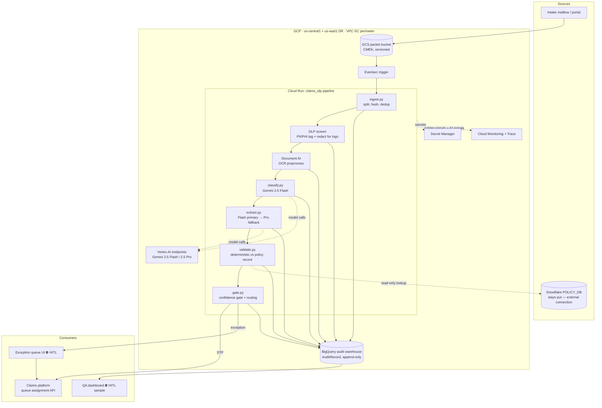

# Reference Architecture — FNOL Claims Intake IDP (claims-idp)

> Stage 5 · Owner: architecture agent · Input: 03-assessment.md (HYBRID verdict), 04-business-case.md (funded 2026-07-18)
> Consulted: cloud-gcp, cloud-aws, cloud-azure, cloud-onprem, model-selector, connector-advisor

## Component diagram



## Sequence diagram (one packet, happy path + fallback)

```mermaid
sequenceDiagram
    participant G as GCS/Eventarc
    participant P as claims_idp (Cloud Run)
    participant D as Document AI
    participant F as Gemini 2.5 Flash
    participant Pr as Gemini 2.5 Pro
    participant S as Snowflake
    participant B as BigQuery audit
    participant C as Claims platform
    G->>P: packet.created event
    P->>P: ingest: split, hash, dedup · DLP tag
    P->>D: OCR each document (parallel)
    D-->>P: text + layout + quality score
    P->>F: classify docs (schema-constrained JSON)
    F-->>P: DocType + confidence
    P->>F: extract fields per doc type
    F-->>P: ExtractedFields + per-field confidence + source spans
    alt any required field conf < gate OR OCR quality < floor
        P->>Pr: re-extract low-confidence docs only
        Pr-->>P: ExtractedFields (fallback, ~18% of packets [assumption — confirm])
    end
    P->>S: read-only policy lookup (policy_no, insured, dates)
    S-->>P: policy record (p95 measured 340 ms [measured, 2026-07-20 test])
    P->>P: deterministic validation + confidence gate → RoutingDecision
    P->>B: AuditRecord (every step; write failure = packet failure)
    alt STP (all gates green)
        P->>C: auto-queue assignment
    else exception
        P->>C: create pre-filled record → exception queue ⛔ HITL
    end
    Note over P: p95 budget ≤60 s/packet — see latency budget table
```

## Layer-by-layer choices

| Layer | Choice | Why |
|-------|--------|-----|
| Serving / compute | Cloud Run (min 2 / max 40 instances) | Stateless pipeline; scales to 3.9× CAT surge without capacity planning; per-100ms billing fits bursty intake |
| OCR preprocess | Document AI | Purpose-built for skew/handwriting tail; emits quality score the fallback gate consumes |
| Model + routing | Gemini 2.5 Flash primary → Gemini 2.5 Pro fallback on low-confidence/messy | Cascade meets $0.048/packet expected; Pro only earns its cost on the ~18% tail |
| Retrieval (RAG) | **None** | Not a retrieval problem; policy truth comes from a keyed Snowflake lookup, not semantic search — rejected RAG as unearned complexity |
| Data plane | GCS (packets, CMEK) · Snowflake stays for policy records via external connection · BigQuery (audit) | Policy system of record does not move — carrier's data-eng estate is Snowflake-committed `[stated]` |
| Orchestration | Single linear pipeline in-process (stdlib Python), Eventarc-triggered | Two branch points don't justify a workflow engine; simplest thing that can be audited |
| Guardrails | DLP screen pre-model; schema-constrained decoding; hallucinated-field check vs source spans; no-training data terms on Vertex | Controls matrix below |
| MLOps / LLMOps | Eval gate in CI (`evals/bars.yaml`), canary rollout, prompt/model version pinned per AuditRecord | Stage 6 build contract; stage 10 rollout |

## Cloud comparison — same question, four answers (like-for-like)

| Layer | **GCP (winner)** | AWS (runner-up) | Azure (third) | On-prem (rejected) |
|-------|------------------|-----------------|---------------|--------------------|
| OCR | Document AI | Textract | Document Intelligence | Tesseract + custom (weakest on handwriting tail) |
| Model | Vertex AI: Gemini 2.5 Flash + 2.5 Pro | Bedrock: Claude Haiku/Sonnet class | Azure OpenAI: GPT-4.1-mini/4.1 class | Self-hosted Qwen2.5-VL-72B on A100s |
| Packet store | GCS + CMEK | S3 + KMS | Blob + CMK | NetApp/MinIO |
| Audit warehouse | BigQuery | Redshift / Athena | Synapse / Fabric | Postgres + hand-rolled retention |
| Policy records | Snowflake external connection (native) | Snowflake external (native) | Snowflake external (native) | Snowflake over private link |
| Perimeter / DLP | VPC-SC + Cloud DLP | PrivateLink + Macie | Private Endpoints + Purview | Network zoning; DLP tooling extra |
| Serving | Cloud Run | Lambda/Fargate | Container Apps | K8s cluster (ops burden) |
| Est. unit cost/packet | **$0.048 `[estimated]`** | $0.055 `[estimated]` | $0.061 `[estimated]` | ~$0.19 amortized `[estimated]` (GPU capex ÷ volume) |

**Recommended path: GCP** — (a) Document AI's OCR quality score is the hinge of
the Flash→Pro cascade and comes native; (b) tightest OCR+LLM+warehouse integration
for the audit mandate (every model call lands in BigQuery with one hop);
(c) best unit cost at our volume; (d) carrier already runs GCP for the data
science sandbox `[stated]` — existing org, IAM, and billing.
**Runner-up AWS (Textract + Bedrock/Claude):** fully viable; lost on integration
hop count into an audit warehouse and slightly higher unit cost; kept alive as
the portability target in `llm.py` (env-selected provider).
**Azure third (Document Intelligence + Azure OpenAI):** viable; lost on unit cost
and no existing Azure estate at the carrier.
**On-prem rejected:** no data-sovereignty mandate exists (PRD assumption 4
confirmed by legal 2026-07-20 `[stated]`); GPU capex ≈ $310K `[estimated]` for a
124,800-packet/yr workload is unjustified; handwriting-tail OCR is the weakest.

## PII/PHI controls matrix (data class × control × verified-by)

| Data class | DLP redaction | Encryption | Region | Retention | Access (IAM) | Approved model path | Verified by |
|------------|---------------|------------|--------|-----------|--------------|---------------------|-------------|
| PHI (medical bills) | Cloud DLP infoType scan pre-model; PHI redacted in all logs/traces; raw PHI only inside pipeline memory | CMEK (packet bucket + BQ) | us-central1, DR us-east1, **US only** | Packets 7 yr `[stated, claims records policy]`; logs 13 mo | `claims-idp-runtime` SA only; no human read of raw bucket; break-glass logged | Vertex endpoints w/ data-residency + no-training terms; **never** consumer APIs | T. Okafor (compliance) + pen test wk 12 |
| PII (names, addresses, VIN, license) | DLP tag; masked in non-prod; masked in QA dashboard by default | CMEK | US only | Same as claim record | Role-scoped: specialists see own-queue packets only | Same Vertex boundary | T. Okafor |
| Policy records (Snowflake) | n/a (structured, minimal fields pulled) | Snowflake-native + TLS | Snowflake US region `[stated]` | Governed by carrier DW policy | Read-only service account, 4 columns whitelisted | Never sent to model — deterministic path only | M. Chen (data eng) |
| Audit records (BigQuery) | Prompt/response stored with PHI **redacted**, source-span offsets kept for review | CMEK | US only | 7 yr, append-only, deletion locked | Compliance + QA read; pipeline write-only | n/a | T. Okafor |
| Model prompts/outputs in transit | Schema-constrained JSON only; DLP-screened | TLS 1.3 | Vertex regional endpoints | Not retained by provider (no-training terms, contract §4.2 `[stated]`) | n/a | J. Iyer (config as code) |

## FinOps — unit-cost build-up (expected $0.048/packet vs ≤$0.09 bar)

| Component | Math | $/packet |
|-----------|------|----------|
| Document AI OCR | 10.4 pages `[estimated]` × ~$1.50/1,000 pages | $0.0156 |
| Gemini 2.5 Flash (100% of packets) | ~38K in-tok (images+text) × $0.30/1M + ~2.5K out × $2.50/1M ≈ $0.0114 + $0.0063 | $0.0177 |
| Gemini 2.5 Pro fallback (18% of packets `[assumption — confirm]`) | 0.18 × (~30K in × $1.25/1M + ~2K out × $10/1M) ≈ 0.18 × $0.0575 | $0.0104 |
| Cloud Run + eventing + DLP + BQ streaming | infra $28,800/yr ÷ 124,800 ≈ $0.23 → attribute compute-variable share | $0.0040 |
| **Total expected** | — | **$0.0477 ≈ $0.048 `[estimated]`** |
| Stress case (fallback 30%, pages 13) | recompute | $0.068 — still under the $0.09 bar |

Annual inference+OCR at expected: 124,800 × $0.048 = **$5,990/yr**, matching stage 4.

## Latency budget (p95 ≤60 s/packet)

| Segment | p95 budget | Basis |
|---------|-----------|-------|
| Ingest + DLP | 3 s | measured on prototype `[measured, 2026-07-20]` |
| Document AI OCR (parallel per doc) | 14 s | vendor SLO + prototype |
| Flash classify + extract | 18 s | prototype on 12-doc packet |
| Pro fallback (when taken) | +19 s | prototype |
| Snowflake lookup | 1 s | measured p95 340 ms `[measured]` + margin |
| Validation + gate + audit write + queue call | 5 s | estimated |
| **Total worst path** | **60 s** | fallback path exactly consumes the envelope — no headroom left; risk R2 below |

## Metrics block

| Metric | Baseline | Target | Measured | Method | Owner |
|--------|----------|--------|----------|--------|-------|
| Unit cost / packet | n/a | ≤$0.09; expect $0.048 | — (stage 8 + billing) | Billing export ÷ packets, monthly | J. Iyer |
| p95 latency / packet | n/a | ≤60 s | prototype: 41 s clean / 60 s fallback `[measured]` | Cloud Trace span | J. Iyer |
| Snowflake lookup p95 | unknown at stage 4 | ≤1 s | **340 ms `[measured 2026-07-20]`** — PRD risk R5 retired | Load test, 500 lookups | M. Chen |
| Audit-write success | n/a | 100% (write failure = packet failure) | — (stage 8) | BQ insert errors vs invocations | J. Iyer |

## Decision trail

| Decision | Chosen | Rejected | Why | Approved by |
|----------|--------|----------|-----|-------------|
| Cloud | GCP | AWS, Azure, on-prem | See 4-way table: cascade-native OCR quality score, audit integration, unit cost, existing estate | R. Vance + J. Iyer, 2026-07-21 |
| Policy data | Snowflake stays, external connection | Migrate policy records to BigQuery | Migration risk + data-eng estate commitment; lookup p95 measured fine | M. Chen, 2026-07-20 |
| Fallback design | Per-document Pro re-extraction | Whole-packet Pro rerun | Re-running only low-confidence docs cuts fallback cost ~60% and keeps latency inside envelope | Architecture agent; model-selector concurred |
| RAG layer | None | Vector store over policy docs | Keyed lookup beats semantic search for exact policy matching; RAG adds cost and a failure mode | Architecture agent, 2026-07-19 |
| Orchestration | In-process linear pipeline | Workflow engine (Cloud Workflows / Temporal) | 2 branch points; engine adds ops surface without audit benefit | J. Iyer, 2026-07-19 |
| Audit posture | Append-only BQ, redacted prompt/response + span offsets | Full raw prompt retention | Raw retention would replicate PHI into logs — controls matrix forbids | T. Okafor, 2026-07-21 |

## Risk register

| # | Risk | Sev | Lik | S×L | Mitigation | Owner |
|---|------|-----|-----|-----|------------|-------|
| R1 | Vertex regional capacity throttling during CAT surge (3.9×) | 4 | 2 | 8 | Provisioned throughput quote requested; degrade-to-async mode with SLA alarm (PRD Q5 policy, now ruled: async acceptable during declared CAT `[stated, D. Reyes 2026-07-21]`) | J. Iyer |
| R2 | Fallback path consumes the entire 60 s envelope — zero headroom | 3 | 4 | 12 | Stage-7 experiments must shave ≥5 s (prompt trim, image downscale); p95 bar measured on full mix in stage 8 | Data-science agent |
| R3 | DLP redaction misses a PHI infoType → PHI lands in logs | 5 | 2 | 10 | Custom infoTypes for provider/diagnosis codes; pen test includes log-exfil scenario; quarterly DLP-rule review | T. Okafor |
| R4 | Claims-platform queue API can't accept writes (screen-scrape legacy) | 4 | 2 | 8 | Wk-1 integration spike (build-plan gate); fallback: RPA bridge, cost +$18K `[estimated]` | Delivery TL |
| R5 | Model version bump (Flash/Pro) silently shifts extraction behavior | 4 | 3 | 12 | Model + prompt version pinned per AuditRecord; eval gate re-runs on any version change; canary before fleet | J. Iyer |
| R6 | CMEK/VPC-SC misconfiguration blocks Document AI or Vertex calls at launch | 3 | 2 | 6 | Terraform in `infra/` is plan-safe and reviewed; perimeter dry-run in wk 3 | J. Iyer |

## Assumptions & open questions

1. `[assumption — confirm]` Vertex no-training + residency terms per contract §4.2 cover both Flash and Pro endpoints — legal re-verifies at renewal.
2. `[assumption — confirm]` 18% fallback rate — stage 7 measures the real rate; FinOps stress case covers to 30%.
3. **Resolved this stage:** Snowflake p95 (340 ms `[measured]`); CAT-surge SLA (async OK during declared CAT `[stated]`); residency (US-only confirmed `[stated]`).
4. **Open:** provisioned-throughput pricing quote from GCP — affects run cost by up to +$6K/yr `[estimated]`.
5. `[assumption — confirm]` Exception-queue UI is an embedded panel in the existing claims platform (no new front end funded).

## Handoff to stage 6 (dev-spec / AI Spec)

**You consume:** the component + sequence diagrams (your pipeline stages, verbatim),
the cascade rule (Flash → Pro on per-field confidence or OCR quality floor), the
controls matrix (encode as guardrails), the latency/cost bars, and the build
contract target: **GCP, package `claims_idp`, stdlib-only Python, `LLM_MODE=mock`
keyless mode, Terraform in `infra/`**. **Your job:** turn every bar into a
testable acceptance criterion with full I/O JSON schemas and the CI eval gate.
**Still open for you:** assumption 2 (fallback rate — parameterize the gate,
don't hard-code it) and the abstain-is-correct rule from stage 3 (encode it in
the ExtractedFields schema).
