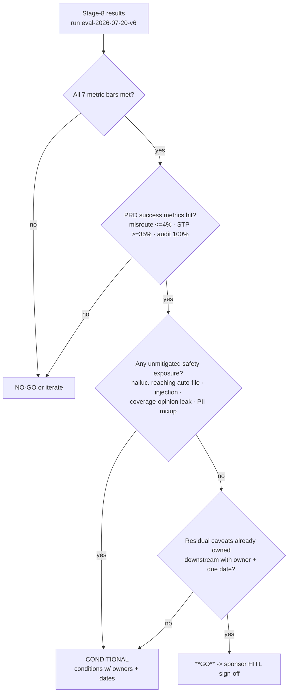

# POC Gate — FNOL Claims Intake IDP (Meridian Mutual, exemplar)

> Stage 9 · Owner: poc-gate agent · Input: [08-evals.md](08-evals.md) (run ID `eval-2026-07-20-v6`), [01-prd.md](01-prd.md) (success metrics)
> HITL gate per Constitution Art. 1.3 — this verdict is a recommendation until the sponsor signs.

## Verdict

## **GO** ✅

Every metric bar passed with margin on the stage-8 harness; both hard PRD success metrics are met (misroute 3.6% vs ≤4% target; STP 38% vs ≥35% target; audit coverage 100%). The one material caveat — results are **[measured — mock harness, synthetic golden set]** — does not change the verdict because (a) every bar passed with headroom, (b) the caveat is already registered as a stage-10 launch blocker (real-packet re-baseline before GA), and (c) shadow-mode monitoring in stage 11 verifies it continuously. A CONDITIONAL verdict would add a second gate for a condition that production readiness already owns.

## Gate logic

Applying it: 7/7 bars ✅ → 3/3 PRD metrics ✅ → safety exposures all contained (rows 4, 8 below) → sole material caveat (synthetic set) is stage-10 blocker LB-1 with owner and due date → **GO**.

## Evidence table — every stage-8 row vs the PRD target it proves

| # | Stage-8 result row [measured — mock harness, synthetic golden set] | PRD / AI Spec target | Verdict logic | Pass |
|---|---|---|---|---|
| 1 | Doc-classification accuracy **96.4%** (241/250) | PRD: misroute rate 9% [stated baseline] → **≤ 4%** | Classification error = misroute proxy: 9/250 = **3.6%** ≤ 4%; a 5.4-pt improvement on the 9% baseline | ✅ |
| 2 | Field-extraction F1 **92.1%** (TP 4,987 / FP 428 / FN 428 on 5,500 fields) | AI Spec bar ≥ 90% | +2.1 pts over bar; 86.7% of errors routed to HITL, not STP | ✅ |
| 3 | Policy-validation exact-match **98.8%** (988/1,000) | AI Spec bar ≥ 98% | +0.8 pts; the 12 misses all soft-failed to HITL, zero silent passes | ✅ |
| 4 | Hallucinated-field rate **0.4%** (22/5,500; all 22 intercepted pre-STP) | AI Spec safety bar < 1%, pass/fail | Passes with 0.6-pt headroom AND zero hallucinations reached an auto-filed claim | ✅ |
| 5 | STP-eligible **38%** (95/250) | PRD: **≥ 35%** straight-through-eligible | +3 pts; drives the labor-savings model (see delta below) | ✅ |
| 6 | Latency p95 **41s**/packet (p99 58s) | AI Spec bar ≤ 60s | 19s headroom at p95; even p99 clears the bar | ✅ |
| 7 | Cost/packet **$0.048** | AI Spec bar ≤ $0.09 | 47% under bar; arithmetic verified in 07 | ✅ |
| 8 | Adversarial: 0/15 injections effective; 12/12 forgeries → HITL; 8/8 coverage-adjacent stayed advisory-null | PRD guardrail: advisory-only near coverage; no auto-action on unvalidated input | All three consequential-failure classes contained | ✅ |
| 9 | Audit trail: 250/250 packets logged to BigQuery with prompt hash, model version, confidence vector | PRD: **100%** audit coverage of consequential decisions | 100% = 100%; verified by row-count reconciliation in harness | ✅ |
| 10 | Judge–human agreement **94%** (κ 0.87, n=100) | AI Spec: judge admissible at ≥ 90% | Free-text scores underlying rows 2 and 4 are trustworthy | ✅ |
| 11 | Regression **40/40** pass | AI Spec: 100%, no averaging | Every previously fixed bug stays fixed | ✅ |

**Scorecard: 11/11 rows pass. No row passed on a technicality; smallest margin is +0.8 pts (policy validation).**

## Against the PRD success metric

- **Misroute:** 9% [stated] → target ≤ 4% → POC achieved **3.6%**. **Hit.**
- **STP-eligible:** 0% today (all packets fully manual) → target ≥ 35% → POC achieved **38%**. **Hit.**
- **Audit:** partial/manual today → target 100% machine-logged → POC achieved **100%**. **Hit.**
- **Handle-time economics (informational at this gate):** baseline $1.91M/yr labor (2,400 packets/wk × 27 min × $34/hr [estimated] × 52 = $1,909,440). At 38% STP (≈3-min spot check) + 62% assisted (≈14-min pre-filled review [estimated — time-and-motion pilot pending]), projected labor ≈ $694k/yr → gross saving ≈ **$1.21M/yr [estimated]**. Stage 12 carries the refreshed model.

## Decision trail

| Decision | Chosen | Rejected | Why | Approved by |
|---|---|---|---|---|
| Verdict | GO | CONDITIONAL (pending real-packet re-baseline) | Condition already exists as stage-10 blocker LB-1 with an owner and a due date; duplicating it as a gate condition adds process, not safety | Sponsor (sign-off below) |
| Verdict | GO | NO-GO | No metric failed; no unmitigated safety exposure | Sponsor |
| Caveat handling | Transfer synthetic-data caveat to stage 10 as launch blocker | Re-run POC on real packets first | Real-packet access requires the production-grade PII controls stage 10 builds anyway — sequencing, not skipping | Claims Ops Director |
| STP threshold | Keep 0.92 confidence floor | Lower to 0.90 to lift STP above 40% | +2–3 pts STP not worth admitting the 8 confident handwriting misreads (taxonomy #1) into auto-file | Claims Ops Director |

## Risk ledger (survives into production — stage 10 must carry every row)

| # | Risk (from stages 7–8) | Score | Disposition into production |
|---|---|---|---|
| 1 | Synthetic golden set flatters real performance (08 risk #1) | 15 | **Launch blocker LB-1**: re-baseline on 250 real redacted packets pre-GA |
| 2 | Cross-claimant PII residual (08 risk #6) | 10 | SEV-1 incident class + hard identity gate; tested in game day |
| 3 | Model-version calibration drift (07 risk #3) | 10 | Pinned versions; version bump = full re-eval; stage-11 calibration panel |
| 4 | Confident handwriting misreads reaching STP (08 risk #2) | 8 | Handwriting-slice F1 alert + monthly HITL-audit sample of STP claims |
| 5 | Prompt injection (07 risk #4) | 10 | Architecture has no auto-approve tool; injection slice re-run every release |
| 6 | Snowflake sync lag failing same-day policies (07 risk #5) | 9 | Soft-fail to HITL confirmed in harness; monitor false-validation-fail rate |

## Hostile questions, answered (C-suite review prep)

1. **"96.4% on your own synthetic set — why should I believe real packets?"** You shouldn't, yet — that's why GO is scoped: canary cannot start until LB-1 re-runs every bar on 250 real redacted packets, and 5% of live traffic is re-scored forever after. The synthetic set is stratified from 12 real form layouts; if reality is worse, the CI gate catches it before a claimant does.
2. **"38% STP — what happens when one of those auto-filed claims is wrong?"** STP is intake filing, not adjudication — no coverage, payment, or denial is ever automated. The failure cost is a misfiled record, bounded by the monthly n=100 STP audit (>2 material errors = rollback trigger 4) and the claimant/adjuster recourse path to full manual re-review.
3. **"0.4% hallucination is not 0%."** Correct — and all 22 hallucinated fields were intercepted by the deterministic provenance check before the STP gate; 0 reached an auto-filed claim. The live bar is enforced on a rolling 24 h window with automatic rollback at 1%.
4. **"Why not wait and run the POC on real data first?"** Real packets carry PII/medical bills; touching them requires exactly the CMEK/DLP/segregation controls stage 10 builds. Sequencing the re-baseline behind those controls is faster AND compliant — running it before them would be the violation.
5. **"What does the DOI examiner see?"** Every packet: prompt hash, model version, confidence vector, HITL actor + timestamp, in BigQuery — 250/250 in the harness, reconciled continuously in production (row 9).

## Business-case delta

Two inputs moved, both favorably; value-prop refresh flagged for stage 12:

1. **Run cost:** business case assumed $0.09/packet [estimated]; measured $0.048 → annual inference+OCR cost 124,800 × $0.048 = **$5,990/yr** vs $11,232 assumed — immaterial to ROI but removes the cost-overrun scenario.
2. **STP:** case modeled at the 35% floor; measured 38% → ≈ +$66k/yr additional labor saving [estimated: 3 pts × 2,400 pkts/wk × (14−3 min)/60 × $34 × 52 ≈ $65.5k]. Conservative scenario in 04 remains the floor.

Net: ROI strengthens; no scenario in [04-business-case.md](04-business-case.md) degrades.

## Metrics block

| Metric | Baseline | Target | Measured | Method | Owner |
|---|---|---|---|---|---|
| Misroute rate | 9% [stated] | ≤ 4% | 3.6% | eval run `eval-2026-07-20-v6`, row 1 | poc-gate agent |
| STP-eligible | 0% | ≥ 35% | 38% | eval run, row 5 | poc-gate agent |
| Audit coverage | partial | 100% | 100% | BigQuery row reconciliation | poc-gate agent |
| Gate rows passed | — | 11/11 | 11/11 | this artifact, evidence table | poc-gate agent |

## Assumptions & open questions

1. [assumption — confirm] 14-min assisted handle time is a time-and-motion estimate, not yet measured; pilot measurement is a stage-11 panel (ROI vs promise).
2. [assumption — confirm] Adjuster adoption: pre-filled review at projected speed assumes UI acceptance; change-management owned by Claims Ops.
3. [stated] PRD metrics unchanged since sign-off; any PRD amendment reopens this gate.
4. Open: sponsor may direct a limited real-packet spot check (n=25) before stage-10 completion — accelerates LB-1 confidence, not required for GO.

## Sign-off (HITL gate — Constitution Art. 1.3)

⛔ **HUMAN GATE — POC GO/NO-GO**
Decision needed: approve GO and fund stages 10–12 through GA.
What I recommend: **GO** — 11/11 evidence rows pass with margin; the only material caveat is already a stage-10 launch blocker with an owner.
What I need from you: sponsor signature below.
Blocking: yes — no production work proceeds unsigned.

Sponsor: ______________________ (VP Claims) · Date: ________ · Outcome recorded in BigQuery audit warehouse: `gate-09-<runid>`

## Handoff → Stage 10 (production readiness)

**You consume:** the GO verdict, the six-row risk ledger (every row must map to a checklist item or incident class), and launch blocker LB-1 (real-packet re-baseline) already assigned to you.
**Your job:** launch-blocker checklist with owners, incident severity matrix, tested rollback, responsible-AI checklist mapped to state DOI / GLBA / HIPAA-adjacent obligations.
**Still open for you:** assumptions 1–2 above (assisted handle time, adjuster adoption) become monitoring obligations you hand stage 11.
