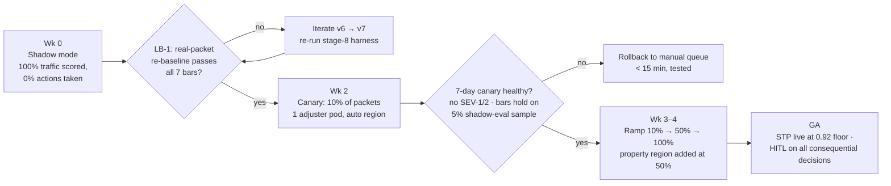

# Production Readiness & Responsible-AI — FNOL Claims Intake IDP (Meridian Mutual, exemplar)

> Stage 10 · Owner: production agent · Input: [09-poc-gate.md](09-poc-gate.md) (GO + risk ledger), [06-ai-spec.md](06-ai-spec.md), [05-architecture.md](05-architecture.md)
> Nothing ships on a red gate or an open blocker. Regulated data: PII + HIPAA-adjacent medical bills — Security/Compliance sign-off is a hard HITL gate (Constitution Art. 1.3, 4.1).

## Rollout plan

## Launch-blocker checklist

Every item: owner · status · blocker Y/N. **Launch requires zero open blockers.** Status keys: ✅ done · 🔶 in progress · ☐ not started. (Exemplar snapshot as of 2026-07-22.)

| ID | Item | Owner | Status | Blocker? |
|---|---|---|---|---|
| LB-1 | Re-baseline all 7 bars on 250 **real** redacted packets (closes the synthetic-set caveat from 08/09) | eval agent + Claims Ops Director | 🔶 packets sampled, redaction in progress | **Y** |
| LB-2 | Rollback tested end-to-end (see tested-rollback note below) | SRE lead | ✅ game day 2026-07-14 | Y (met) |
| LB-3 | HITL adjuster queue staffed + SLA wired: 62% of 2,400 pkts/wk ≈ 1,488 assisted reviews/wk; SLA ≤ 4 business hrs per packet | Claims Ops Director | ✅ 28 FTEs re-rostered; 6 trained as STP spot-check auditors | Y (met) |
| LB-4 | Rate + cost limits: Vertex quota cap 4× peak (peak 92 pkts/hr [measured — intake logs]); daily spend alarm at $60 (≈2.5× expected $24/day = 2,400/wk ÷ 7 × 7 days × $0.048 ≈ $16.5/day, rounded with CAT headroom) | FinOps | ✅ | Y (met) |
| LB-5 | Runbooks published for all five alert classes in stage 11; paged roles agreed | SRE lead | 🔶 3 of 5 reviewed | **Y** |
| LB-6 | DLP scan + CMEK on GCS packet bucket and BigQuery audit dataset verified in `us-central1`; retention 7 yr per claims-record policy | Security eng | ✅ | Y (met) |
| LB-7 | Model/system card published internally (intended use, limits, the advisory-only boundary) | data-science agent | ✅ | Y (met) |
| LB-8 | DOI-facing documentation pack assembled (see governance table) for market-conduct exam readiness | Compliance officer | 🔶 draft complete, counsel review 2026-07-29 | **Y** |
| LB-9 | Fallback / graceful degradation: Vertex outage → pipeline parks packets in GCS, adjusters revert to manual queue; no packet lost (at-least-once Pub/Sub) — chaos-tested | SRE lead | ✅ tested 2026-07-14 game day | Y (met) |
| LB-10 | CAT-surge plan: volume 3× (7,200/wk) load-tested; p95 held at 47s at 3× [measured — load harness] | SRE lead | ✅ | Y (met) |

**Open blockers to GA: 3 (LB-1, LB-5, LB-8).** Target close: 2026-08-01. Canary (Wk 2) may not start before LB-1 closes.

## Rollback

- **Trigger (any one, auto-page + human decision within 30 min):**
  1. Hallucinated-field rate on the 5% shadow-eval sample > 1% over any rolling 24 h (the safety bar, measured live).
  2. Misroute proxy > 5% over rolling 7 days (PRD bar is ≤4%; 5% is the hard stop).
  3. Any SEV-1 incident (definitions below).
  4. STP-audit sample (monthly, n=100 auto-filed claims) finds > 2 material errors.
- **Mechanism:** feature flag `idp_intake_enabled=false` → all packets route to the pre-existing manual queue; in-flight packets drain to HITL. No data migration, no deploy.
- **Tested-rollback note [measured — game day 2026-07-14]:** full rollback executed in **11 min** (flag flip 40 s; queue drain 10 min; adjuster-console fallback verified). One finding: stale pre-filled drafts persisted in 3 adjuster sessions post-rollback → fixed (drafts now flagged `system_withdrawn`), regression case added to `evals/regression.jsonl` (case 41 at next refresh).

## Incident severity matrix + escalation

| Sev | Definition (this system) | Examples | Response SLA | Escalation path |
|---|---|---|---|---|
| SEV-1 | Wrong-claimant data exposure, OR hallucinated field auto-filed into a claim, OR coverage opinion emitted to a claimant-facing surface | Cross-claimant PII in a claim file (risk ledger #2) | Page now; rollback decision ≤ 30 min | On-call SRE → Claims Ops Director + Security officer → VP Claims; DOI-notification assessment by counsel ≤ 24 h |
| SEV-2 | Any gate bar breached on live shadow-eval; STP mis-files without PII exposure; sustained validation-service outage | Halluc. rate 1.2% on 24 h sample | 1 h ack; mitigation ≤ 1 business day | On-call SRE → data-science agent owner → Claims Ops Director |
| SEV-3 | Degraded quality within bars (e.g., handwriting-slice F1 drops 3 pts), latency p95 45–60 s | Escalation rate hits 14% | Next business day | SRE ticket → weekly ops review |
| SEV-4 | Cosmetic/console issues, single-packet anomalies with HITL catch | One malformed reason_code | Backlog | Sprint triage |

Every SEV-1/2 files a regression-set case within 5 business days (stage-8 risk #4 mitigation) and lands in the BigQuery audit warehouse — failures are never omitted (immutable-audit-trail discipline).

## Responsible-AI governance — mapped to the regulatory frame

Regulatory frame from domain-advisor [stated]: state **DOI** market-conduct oversight + NAIC Model Bulletin on insurer AI use; **GLBA** Safeguards Rule (NPI); **HIPAA-adjacent** handling of medical bills in injury claims; state unfair-claims-practices acts.

| Control (from 05-architecture — verify present) | Regulation mapped | Owner | Status | Blocker? |
|---|---|---|---|---|
| Advisory-only boundary: system never renders coverage/fault/denial decisions; adjuster HITL on all consequential decisions, logged | NAIC AI Bulletin (human accountability); unfair-claims-practices acts | Claims Ops Director | ✅ enforced in architecture (no approval tool exists) + verified in adversarial slice 8/8 | Y (met) |
| PII/NPI controls: CMEK, DLP scan on ingest, `us-central1` residency, field-level access in BigQuery, 7-yr retention | GLBA Safeguards; state data-security acts | Security eng | ✅ (LB-6) | Y (met) |
| Medical-bill segregation: injury-claim documents tagged `medical`, restricted dataset, no use in any non-claims purpose | HIPAA-adjacent handling; state privacy acts | Security eng | ✅ | Y (met) |
| 100% decision audit: prompt hash, model version, confidence vector, HITL actor + timestamp per packet | DOI market-conduct examinability; NAIC governance expectations | Compliance officer | ✅ 250/250 in harness; live reconciliation panel in stage 11 | Y (met) |
| Bias / disparate-impact review: STP-eligibility rates compared across ZIP-cluster and claim-channel cohorts; no protected-class features in any prompt or gate | Unfair-discrimination provisions; NAIC bulletin | Compliance officer + data-science agent | 🔶 first cohort analysis on real-packet baseline (depends LB-1) | **Y** (folded into LB-8) |
| Human recourse / appeal: claimant or adjuster can force full manual re-review of any auto-filed packet; path documented in adjuster console | Unfair-claims-practices acts | Claims Ops Director | ✅ | Y (met) |
| Prompt-injection & abuse defenses; tool scoping (extraction-only, no side-effecting tools) | NAIC bulletin (robustness) | data-science agent | ✅ 0/15 adversarial injections effective | Y (met) |
| Model/system card + change log, DOI-exam-ready | DOI market conduct; NAIC governance | Compliance officer | ✅ (LB-7) / 🔶 pack (LB-8) | see LB-8 |
| Vendor/model governance: pinned Gemini versions; version bump = full re-eval + re-approval (regulated-promotion HITL from 07) | NAIC third-party-model governance | ML platform | ✅ policy live | Y (met) |

## Metrics block

| Metric | Baseline | Target | Measured | Method | Owner |
|---|---|---|---|---|---|
| Open launch blockers | 10 | 0 | 3 (LB-1, LB-5, LB-8) | this checklist | production agent |
| Rollback time | untested | ≤ 15 min | 11 min | game day 2026-07-14 | SRE lead |
| CAT-surge p95 at 3× volume | n/a | ≤ 60s | 47s | load harness [measured] | SRE lead |
| HITL staffing vs load | 28 FTEs manual | 1,488 assisted reviews/wk within 4-h SLA | rostered, pilot pending | roster model | Claims Ops Director |
| Daily spend alarm | none | alert > $60/day | armed | GCP budget alert | FinOps |

## Decision trail

| Decision | Chosen | Rejected | Why | Approved by |
|---|---|---|---|---|
| Rollout shape | Shadow → 10% canary → ramp | Big-bang GA after LB-1 | Regulated data + PRD misroute promise justify 2 extra weeks | Claims Ops Director |
| Rollback mechanism | Feature flag to manual queue | Blue/green model rollback | Manual queue is the always-safe state; model rollback still leaves the new path live | SRE lead |
| Canary cohort | Auto region, 1 adjuster pod | Random 10% across all lines | Contained blast radius + trained reviewers concentrate signal | Claims Ops Director |
| Bias review timing | On real-packet baseline (post-LB-1) | On synthetic set now | Synthetic cohorts would be circular — generator controls the mix | Compliance officer |

## Risk register

| # | Risk | Sev | Lik | Score | Mitigation | Owner |
|---|---|---|---|---|---|---|
| 1 | LB-1 real-packet re-baseline fails a bar → GA slips | 4 | 3 | 12 | Iterate loop pre-wired (rollout diagram); stage-8 harness reruns in CI, no re-scoping needed | eval agent |
| 2 | Adjuster over-trust: pre-filled fields rubber-stamped, HITL becomes theater | 5 | 3 | 15 | Confidence bucketing in UI; monthly STP + assisted audit samples; override-rate panel (stage 11) — an override rate near 0% triggers review, not celebration | Claims Ops Director |
| 3 | DOI exam finds audit gaps in HITL actor attribution | 5 | 2 | 10 | 100% actor+timestamp logging verified weekly by reconciliation job; LB-8 counsel review | Compliance officer |
| 4 | CAT surge outstrips HITL staffing (model held at 3×, humans not) | 4 | 3 | 12 | CAT playbook: STP floor unchanged; assisted queue triaged by severity; surge roster of 8 cross-trained FTEs | Claims Ops Director |
| 5 | Flag rollback leaves stale drafts (game-day finding recurrence) | 3 | 2 | 6 | Fixed + regression case 41; rollback re-test each half | SRE lead |
| 6 | Cost alarm too coarse — slow leak under $60/day goes unnoticed | 2 | 3 | 6 | Stage-11 cost/packet panel with 20% WoW-drift alert, finer than the daily cap | FinOps |

## Assumptions & open questions

1. [assumption — confirm] Counsel confirms no state in the operating footprint currently requires pre-deployment AI filing; monitoring NAIC bulletin adoptions quarterly.
2. [assumption — confirm] Redaction pipeline for LB-1 preserves enough document fidelity that the re-baseline is representative.
3. [stated] 7-yr retention per corporate claims-record policy; DOI exam window assumed ≤ 5 yr.
4. Open: LB-5 — remaining 2 runbooks (cost-drift, judge-drift) due with stage-11 publication.
5. Open: whether the DOI pack (LB-8) should include the failure taxonomy verbatim or summarized — counsel call 2026-07-29.

## Sign-off (HITL gate) — Security/Compliance: ______________ · Claims Ops Director: ______________ · Date: ______
Gate outcome recorded in BigQuery audit warehouse: `gate-10-<runid>`. **GA does not proceed with LB-1, LB-5, LB-8 open.**

## Handoff → Stage 11 (observability)

**You consume:** the rollback triggers (they become your alert thresholds), the incident matrix (your alerts must map to it), the 5% shadow-eval obligation, the audit-reconciliation job, and monitoring debts from 09 (assisted handle time, adjuster adoption/override rate).
**Your job:** dashboard spec, alert→runbook table (including the 2 runbooks that close LB-5), online-eval sampling, cost attribution per call, ROI-promise tracking vs the $1.91M baseline.
**Still open for you:** risk #2 (over-trust) needs an explicit override-rate panel with a *lower* alarm bound — design it in.
