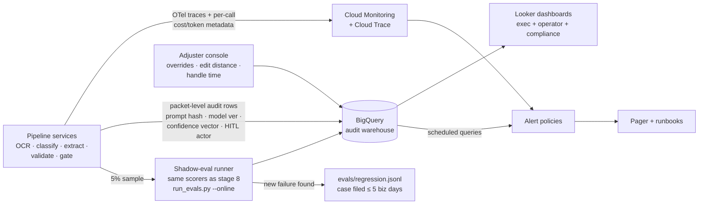

# Observability — FNOL Claims Intake IDP (Meridian Mutual, exemplar)

> Stage 11 · Owner: observability agent · Input: [10-production.md](10-production.md) (rollback triggers, incident matrix, LB-5 runbook debt), [08-evals.md](08-evals.md) (bars, regression loop)
> Discipline: golden signals + AI signals, every alert maps to a runbook, online eval keeps the stage-8 bars honest in production, and the $1.91M/yr ROI promise is a monitored metric — not a slide.

## Telemetry topology

## Dashboard spec

### Operator view (on-call + ML owner)

| Panel | Metric | Source | Threshold (green / amber / red) |
|---|---|---|---|
| Pipeline health | Success rate per stage; Pub/Sub queue depth | Cloud Monitoring | ≥99.5% / 98–99.5% / <98% · queue >500 packets = amber |
| Latency | p50/p95/p99 per packet, end-to-end + per stage | Cloud Trace | p95 ≤45s / 45–60s / >60s (bar) |
| Escalation rate | % packets hitting Pro fallback | BigQuery audit rows | 7–12% / 12–15% / >15% for 2 wk (drift trigger from 07) |
| Shadow-eval quality | Field-F1, doc-class acc., validation match on 5% sample (rolling 7-day) | Shadow-eval runner → BigQuery | F1 ≥91% / 90–91% / <90% (bar breach = SEV-2) |
| Hallucination (safety) | Provenance-check trip rate + judged halluc. rate on shadow sample, rolling 24 h | Shadow-eval runner | <0.5% / 0.5–0.75% / >0.75% early-warning; >1% = rollback trigger 1 |
| OCR drift | Document AI mean confidence vs 0.91 baseline | Pipeline metadata → BigQuery | ≥0.88 / 0.86–0.88 / <0.86 (−5 pt drift trigger) |
| Handwriting slice | F1 on handwriting-tagged packets (separate series) | Shadow-eval runner | ≥88% / 85–88% / <85% (risk 08#2) |
| HITL queue | Assisted-review backlog vs 4-h SLA; reviews/adjuster/day | Adjuster console → BigQuery | SLA ≥95% / 90–95% / <90% |
| Override & edit rate | % assisted packets where adjuster edits ≥1 pre-filled field; mean edit distance | Adjuster console | **Band alarm: 4–20% green; <2% red-LOW (over-trust, risk 10#2); >25% red-HIGH (quality)** |
| Cost | $/packet (rolling day), $/day vs $60 alarm, Flash:Pro spend split | Billing export joined to audit rows | ≤$0.06 / $0.06–0.09 / >$0.09 (bar) |

### Exec view (VP Claims, monthly)

| Panel | Metric | Source | Threshold |
|---|---|---|---|
| Is it working? | STP share · misroute proxy · SEV-1/2 count | BigQuery | STP ≥35% · misroute ≤4% · SEV-1 = 0 |
| ROI promise | Realized labor saving run-rate vs plan (see ROI section) | BigQuery + roster data | ≥$85k/mo by month 6 |
| Volume | Packets/wk vs 2,400 baseline; CAT-surge flag | BigQuery | 3× surge playbook trips at 6,000/wk |

### Compliance view (quarterly + exam-ready)

| Panel | Metric | Source | Threshold |
|---|---|---|---|
| Audit completeness | Audit rows ÷ packets processed (reconciliation job) | BigQuery scheduled query | = 100%, any gap = SEV-2 |
| HITL attribution | % consequential decisions with actor + timestamp | BigQuery | = 100% |
| Cohort parity | STP-eligibility rate by ZIP-cluster and channel cohort | BigQuery (quarterly job) | any cohort gap >5 pts → Compliance review |
| Advisory boundary | Count of coverage-language flags emitted claimant-facing | Shadow-eval judge criterion 3 | = 0 |

## Alerts → runbooks

Every alert maps to the stage-10 incident matrix and a runbook; RB-4 and RB-5 close launch blocker LB-5.

| Alert | Threshold | Sev | Owner | Runbook (first 3 steps) |
|---|---|---|---|---|
| Hallucination rate breach | >1% rolling 24 h (shadow sample) | SEV-1→rollback | on-call SRE | RB-1: freeze STP flag → page Claims Ops → run rollback decision protocol (≤30 min) |
| Misroute proxy breach | >5% rolling 7 d | SEV-1→rollback | on-call SRE | RB-1 (same protocol, misroute branch) |
| Shadow-eval bar miss (F1/class/validation) | any bar <bar for 48 h | SEV-2 | data-science agent | RB-2: pull failing samples from BigQuery → classify vs taxonomy → file regression cases → prompt/threshold fix behind CI gate |
| Pipeline stage failure / queue depth | success <98% or queue >2,000 | SEV-2 | on-call SRE | RB-3: check Vertex/DocAI status → flip to park-and-manual fallback (LB-9) → drain when green |
| Cost drift | $/packet WoW +20% or >$0.09, or Pro escalation >15% 2 wk | SEV-3 | FinOps | RB-4: attribute drift Flash vs Pro vs OCR via per-call attribution → check escalation panel → if input drift, trigger 07 refresh pipeline |
| Judge drift | judge–human agreement <90% on monthly 100-sample re-validation | SEV-3 | eval agent | RB-5: pull judge from gate (deterministic scorers keep running) → re-validate rubric → re-admit at ≥90% |
| Override-rate band exit | <2% (over-trust) or >25% (quality) sustained 2 wk | SEV-3 | Claims Ops Director | RB-6: sample 50 packets → distinguish rubber-stamping vs model regression → retrain adjusters or file SEV-2 |
| Audit reconciliation gap | rows ≠ packets | SEV-2 | Compliance officer | RB-7: halt STP flag → replay missing rows from Pub/Sub DLQ → root-cause before re-enable |

## Online eval

- **Method:** ☑ live-shadow sample — **5% of production packets** (≈120/wk = 2,400 × 5%) re-scored by the exact stage-8 scorers (`run_evals.py --online`); deterministic scorers on all sampled packets, LLM judge on free-text fields. Human adjudication of judge-flagged items: ≈10/wk.
- **Ground truth for shadow scoring:** the adjuster's final accepted record (post-HITL) is the label; STP packets use the monthly n=100 audit sample as their labeled slice.
- **Cadence:** scored continuously; bars evaluated on rolling 24 h (safety) and 7 d (quality) windows — same windows as the rollback triggers.
- **Regression loop:** every shadow-eval failure and every SEV-1/2 files a case into `evals/regression.jsonl` within 5 business days (stage-8 risk #4); weekly ops review verifies the loop is fed.
- **Also:** full stage-8 harness (golden 250 + adversarial 60 + regression) re-runs nightly against the pinned prod build — catches infra drift, not just model drift.

## Drift detection → refresh pipeline

The five stage-7 triggers are wired as alerts: unknown-form rate >2%/wk · OCR confidence −5 pts · Pro escalation >15% for 2 wk · hallucination >0.75%/wk · CAT declaration (manual flag). Any trigger → 07 refresh pipeline → full CI eval gate → HITL promotion approval (Claims Ops Director + ML lead). No silent promotes.

## Cost attribution (per call, vs the business case)

Every model call writes `{packet_id, stage, model, tokens_in, tokens_out, unit_cost}` to the audit row; billing-export reconciliation weekly (±5% tolerance).

| Unit | Expected cost | Source | vs ROI promise |
|---|---|---|---|
| OCR per packet | $0.0165 (11 pp × $1.50/1k) | DocAI billing | in $0.048 envelope |
| Flash extraction per packet | $0.014 | per-call tokens | in envelope |
| Pro fallback per escalated packet | $0.0575 × 9.2% = $0.0053 | per-call tokens | escalation panel guards this term |
| Platform amortized | $0.012 | GCS/BQ/orchestration billing ÷ packets | reviewed monthly |
| **All-in per packet** | **$0.048** [measured — mock harness; re-verify wk 1 of canary] | billing ÷ packets | bar ≤$0.09 |
| Annual inference+OCR | 124,800 × $0.048 = **$5,990/yr** | rollup | vs $11,232 assumed in 04 |
| Annual platform + eval maintenance | $38,400 + $56,000 = $94,400/yr [estimated] | billing + roster | tracked on exec view |

## ROI-promise monitoring (vs the $1.91M baseline)

- **Baseline [estimated, from 01/04]:** $1,909,440/yr = 2,400 pkts/wk × 27 min × ($34/60)/min × 52.
- **Promise [estimated, refreshed at 09]:** gross saving ≈ $1.21M/yr = baseline − projected assisted labor ($694k/yr = [912 STP × 3 min + 1,488 assisted × 14 min]/wk ÷ 60 × $34 × 52).
- **Measured, not assumed:** the adjuster console logs actual handle time per packet (assumption 09#1). Panels: realized min/packet by path (STP-spot-check vs assisted vs manual-fallback) · realized weekly labor $ vs $36,720 baseline · savings run-rate vs plan curve (ramp-adjusted: 25% of promise by month 2, 70% by month 4, 100% by month 6).
- **Alert:** realized saving < 70% of ramp-adjusted plan for 2 consecutive months → exec review; value-prop (04) formally refreshed rather than quietly missed.

## Metrics block

| Metric | Baseline | Target | Measured | Method | Owner |
|---|---|---|---|---|---|
| Shadow-eval coverage | 0% | 5% of packets | wired (canary pending) | sampler config + BQ count | observability agent |
| Alert→runbook coverage | 3/5 | 8/8 alerts mapped | 8/8 (RB-1–7 published) | this artifact; closes LB-5 | SRE lead |
| Audit completeness | partial (manual era) | 100% | 100% in harness; live reconciliation armed | scheduled query | Compliance officer |
| Realized saving run-rate | $0 | $1.21M/yr by month 6 [estimated] | — (post-GA metric) | console handle-time × roster | Claims Ops Director |
| Nightly harness pass | n/a | green | green on mock build | CI history | eval agent |

## Decision trail

| Decision | Chosen | Rejected | Why | Approved by |
|---|---|---|---|---|
| Online-eval method | 5% live shadow + nightly full harness | Weekly scheduled eval-set only | Scheduled-only misses fast drift between runs; 5% (~120 pkts/wk) is statistically useful for the 24 h safety window at our volumes | data-science agent |
| Shadow ground truth | Adjuster-accepted record | Fresh human labeling of shadow sample | Adjuster record is already produced by the workflow at zero marginal cost; monthly STP audit covers the auto-filed blind spot | Claims Ops Director |
| Override alarm shape | Two-sided band (2%–25%) | High-side only | Over-trust (risk 10#2) is the insidious failure; near-zero override is a red flag, not a win | Claims Ops Director |
| Dashboards | Looker on BigQuery | Grafana on Cloud Monitoring only | Quality/cost/ROI metrics live in BigQuery audit rows; compliance view needs SQL-auditable lineage | SRE lead |

## Risk register

| # | Risk | Sev | Lik | Score | Mitigation | Owner |
|---|---|---|---|---|---|---|
| 1 | Adjuster-accepted record as ground truth inherits adjuster errors → shadow eval blind to shared mistakes | 4 | 3 | 12 | Monthly independent 100-sample audit (STP + assisted) double-labeled; disagreement rate itself is a panel | eval agent |
| 2 | 5% sample too thin for rare failure modes (e.g., cross-claimant) between nightly harness runs | 4 | 2 | 8 | Deterministic identity gate runs on 100% of packets (not sampled); shadow sampling stratified to over-weight edge tags 2× | observability agent |
| 3 | Alert fatigue: 8 alert classes + band alarms page too often, on-call tunes them out | 3 | 3 | 9 | SEV-3s go to ticket queue not pager; monthly alert-precision review (target >70% actionable) | SRE lead |
| 4 | ROI panel disputed — roster savings claimed by ops, not attributable to system | 3 | 3 | 9 | Handle-time measured per packet in console (not survey); baseline 27 min frozen and signed in PRD | Claims Ops Director |
| 5 | Billing-export lag (24–48 h) delays cost-drift detection | 2 | 4 | 8 | Per-call token counts give real-time proxy; billing reconciles weekly at ±5% | FinOps |
| 6 | Regression loop starves post-launch (nobody files cases once the team moves on) | 4 | 2 | 8 | Case-filing is a runbook step (RB-2) and a weekly-ops-review checklist item with a named owner | observability agent |

## Assumptions & open questions

1. [assumption — confirm] 5% sampling with 2× edge-tag over-weighting yields ≥8 edge packets/wk — validate in canary week 1.
2. [assumption — confirm] Adjuster console can emit per-field edit events (needed for override/edit-distance panels) — UI team committed, not yet shipped.
3. [stated] Looker licensing already covered under the existing GCP agreement.
4. Open: whether DOI pack (10 LB-8) wants read-only access to the compliance view or exported PDFs — counsel call 2026-07-29.
5. Open: CAT-mode dashboard preset (volume-normalized thresholds) — build before hurricane season peak (Sept).

## Handoff → Stage 12 (delivery brief)

**You consume:** the full monitoring contract above — especially the ROI-promise panel design (the brief's savings claim must cite it as the verification mechanism), the alert→runbook table (closes LB-5), and the compliance view (evidence for the DOI pack).
**Your job:** one-page exec summary, full metrics rollup from `metrics.json`, complete decision log across stages 1–11, dev-pipeline handoff packet.
**Still open for you:** carry assumptions 2 and 5, plus the three open stage-10 blockers (LB-1, LB-8 — LB-5 closes with this artifact), into the brief's open-items list.
