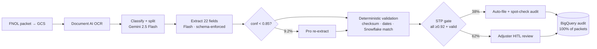

# Delivery Brief — FNOL Claims Intake IDP (Meridian Mutual, exemplar)

> Stage 12 · Owner: brief agent · Input: all prior artifacts (01–11) + [metrics.json](metrics.json)
> Two readers: the VP who reads only §1, and the engineer who reads §8. Both get a complete, self-contained story.

---

## 1. Executive summary (one page, standalone)

**The problem.** Meridian Mutual's claims intake hand-keys 2,400 First Notice of Loss packets every week — 124,800/yr — at 27 minutes per packet [stated], across 28 FTEs. That is ≈ **$1.91M/yr in intake labor** ($1,909,440 = 2,400/wk × 27 min × $34/hr loaded [estimated] × 52), and 9% of packets are misrouted [stated], each misroute adding cycle time and adjuster rework in a DOI-examined process.

**What we built.** A hybrid intelligent-document-processing pipeline on GCP: Document AI OCR → Gemini 2.5 Flash extraction (Gemini 2.5 Pro fallback on low confidence) → deterministic validation against Snowflake policy records → confidence-gated routing. **The system never decides a claim.** It is advisory-only near coverage; adjusters review every consequential decision; 100% of packets carry a machine-verifiable audit record in BigQuery (prompt hash, model version, confidence vector, human actor).

**The evidence.** The POC gate returned **GO, 11/11 evidence rows passed** [measured — mock harness, synthetic golden set; real-packet re-baseline is the top launch blocker]:
misroute 3.6% (target ≤4%, baseline 9%) · straight-through-eligible 38% (target ≥35%) · extraction F1 92.1% (bar ≥90%) · hallucinated fields 0.4% with zero reaching an auto-filed claim (bar <1%) · p95 41s/packet (bar ≤60s) · $0.048/packet (bar ≤$0.09) · audit coverage 100%.

**The number.** Projected gross labor saving ≈ **$1.21M/yr [estimated]** (38% of packets drop to a 3-min spot check; the rest to a ~14-min pre-filled assisted review), against ≈ $100k/yr run cost (inference + OCR $5,990 + platform $38.4k + eval maintenance $56k [estimated]) and a $410k build [estimated] → **payback ≈ 4.4 months** ($410k ÷ $92.9k/mo net). The saving is not a slide number: adjuster handle time is instrumented per packet, and an ROI panel alarms if realized savings fall below 70% of the ramp plan.

**The ask.** Approve GA contingent on closing 2 remaining launch blockers (target 2026-08-01): **LB-1** re-baseline all bars on 250 real redacted packets; **LB-8** DOI-exam documentation pack incl. cohort-parity review. Rollout: shadow → 10% canary → ramp; rollback to the manual queue is feature-flagged and **tested at 11 minutes** on the 2026-07-14 game day.

**The one-line risk.** Results to date are on a synthetic golden set — real-packet re-baseline (LB-1) is the gate between canary and everything above; if it misses a bar, we iterate behind the CI eval gate before any claimant-facing exposure.

---

## 2. The initiative at a glance

| Stage | Verdict / key output | Artifact |
|---|---|---|
| 1 Intake / PRD | Signed; metrics: misroute ≤4%, STP ≥35%, audit 100% | [01-prd.md](01-prd.md) |
| 2 Process map | 27-min as-is flow → gated to-be flow | [02-process-map.md](02-process-map.md) |
| 3 Assessment | **HYBRID** (GenAI extraction + deterministic control) | [03-assessment.md](03-assessment.md) |
| 4 Business case | ≈$1.21M/yr gross [estimated], payback ≈4.4 mo | [04-business-case.md](04-business-case.md) |
| 5 Architecture | **GCP** (DocAI + Vertex Gemini + GCS + BigQuery; Snowflake SoR) | [05-architecture.md](05-architecture.md) |
| 6 AI Spec | 22-field schema, 7 metric bars, CI eval gate | [06-ai-spec.md](06-ai-spec.md) |
| 7 Data science | v6: prompt+few-shot+splitter+gating; 8-run experiment log | [07-data-science.md](07-data-science.md) |
| 8 Evals | 250/60/40 sets; **7/7 bars passed**; judge κ 0.87 | [08-evals.md](08-evals.md) |
| 9 POC gate | **GO** — 11/11 evidence rows | [09-poc-gate.md](09-poc-gate.md) |
| 10 Production | 7/10 blockers closed; rollback tested 11 min | [10-production.md](10-production.md) |
| 11 Observability | 8 alerts→7 runbooks; 5% shadow eval; ROI panel | [11-observability.md](11-observability.md) |
| 12 Brief | this document + [metrics.json](metrics.json) | — |

## 3. The solution

Hybrid, deliberately: GenAI does what it is good at (reading messy documents), deterministic code does what regulators and CFOs need (validation, gating, audit). Model routing is economic — Flash on everything, Pro only on the 9.2% of packets where a critical field falls below 0.85 confidence.

Key controls: advisory-only boundary (no coverage/fault output, verified 8/8 adversarial); provenance post-check on every field (hallucination backstop); CMEK + DLP + us-central1 residency + medical-bill segregation (GLBA / HIPAA-adjacent); pinned model versions with re-eval-before-promote.

## 4. The business case (refreshed post-POC)

| Line | Value | Arithmetic / label |
|---|---|---|
| Baseline intake labor | $1,909,440/yr | 2,400/wk × 27 min × $34/hr [estimated] × 52 |
| Post-launch labor | ≈$694k/yr | (912 STP × 3 min + 1,488 assisted × 14 min)/wk ÷ 60 × $34 × 52 [estimated] |
| Gross saving | ≈$1.21M/yr | baseline − post-launch |
| Run cost | ≈$100k/yr | $5,990 inference+OCR (124,800 × $0.048 [measured — mock harness]) + $38.4k platform + $56k eval maintenance [estimated] |
| Build | $410k one-time [estimated] | stages 6–10 build + integration |
| **Payback** | **≈4.4 months** | 410,000 ÷ ((1,214,968 − 100,390)/12 ≈ 92,881/mo) |
| POC delta | favorable | cost/packet came in 47% under bar; STP +3 pts over floor (+≈$66k/yr) |

Sensitivity (from 04, unchanged): the case swings on (1) assisted handle time (14-min estimate — now instrumented per packet) and (2) STP share holding ≥35% on real traffic (LB-1 + shadow eval verify).

## 5. The evidence — metrics rollup (mirrors metrics.json)

All measured values **[measured — mock harness, synthetic golden set]**, run `eval-2026-07-20-v6`; harness at `exemplar/claims-idp/build/`.

| Metric | Bar | Measured | Margin | PRD linkage |
|---|---|---|---|---|
| Doc-classification accuracy | ≥95% | 96.4% | +1.4 | misroute 3.6% ≤ 4% target (baseline 9%) |
| Field-extraction F1 | ≥90% | 92.1% | +2.1 | quality floor for assisted review |
| Policy-validation exact-match | ≥98% | 98.8% | +0.8 | wrong-policy filings blocked |
| Hallucinated-field rate | <1% pass/fail | 0.4% | 0.6 headroom | zero reached auto-file |
| STP-eligible | ≥35% | 38% | +3 | the savings engine |
| Latency p95 | ≤60s | 41s | 19s | intake SLA |
| Cost/packet | ≤$0.09 | $0.048 | 47% under | FinOps envelope |
| Judge–human agreement | ≥90% | 94% (κ 0.87) | +4 | free-text scores admissible |
| Regression | 100% | 40/40 | — | no resurrected bugs |
| Audit coverage | 100% | 100% (250/250) | — | DOI examinability |

Failure taxonomy headline (428 field errors): handwriting 149 · multi-vehicle 87 · doc-split 64 · low-res photos 52 · date ambiguity 34 · transpositions 23 · other 19 — 86.7% of all errors landed in HITL, not auto-file.

## 6. The plan

- **Wk 0–2:** close LB-1 (real-packet re-baseline) and LB-8 (DOI pack; counsel 2026-07-29); shadow mode on 100% of traffic. LB-5 closed by stage 11 (runbooks RB-1–7).
- **Wk 2:** 10% canary, auto region, 1 adjuster pod — starts only when LB-1 is green.
- **Wk 3–4:** ramp 10→50→100%; property region at 50%; GA at zero open blockers.
- **Team:** ML lead (0.5 FTE run), SRE on-call rotation, 28 adjuster FTEs re-rostered (6 as STP auditors), FinOps + Compliance part-time.
- **HITL gates and owners:** PRD (VP Claims — signed) · business case (CFO — approved) · POC GO (VP Claims sponsor — signed at 09) · production/GA (Security-Compliance + Claims Ops Director — pending blockers) · regulated model promotion (Claims Ops Director + ML lead — standing).

## 7. Risks & open questions (the surviving ledger)

| # | Risk | Score | Where mitigated |
|---|---|---|---|
| 1 | Synthetic set flatters real performance | 15 | LB-1 gate + 5% shadow eval (11) |
| 2 | Adjuster over-trust turns HITL into theater | 15 | Two-sided override-band alarm + monthly audits (11) |
| 3 | Cross-claimant PII mixup | 10 | 100% identity gate + SEV-1 class + game-day tested (10) |
| 4 | Model-version calibration drift | 10 | Pinned versions; bump = full re-eval + HITL promote (07/10) |
| 5 | CAT surge outstrips human staffing | 12 | 3× load-tested; surge roster; CAT dashboard preset due Sept (10/11) |
| 6 | Prompt injection via documents | 10 | No side-effecting tools; 0/15 adversarial; re-run each release (07/08) |

Open items: LB-1, LB-8 (blockers) · real-packet stratification check (08 A1) · per-field edit events in adjuster console (11 A2) · CAT regression slice with Q3 golden refresh (07/08) · DOI access mode for compliance view (11 O4).

## 8. Decision trail (audit — Constitution Art. 7)

| Stage | Decided | Rejected | Why | Gate/approver |
|---|---|---|---|---|
| 3 | HYBRID | Pure GenAI; classical-ML-only | Regulator needs deterministic validation + audit; docs too messy for templates-only | Claims Ops Director |
| 3/7 | Gemini 2.5 Flash primary + Pro fallback | Pro everywhere (v7) | +0.6 F1 at 2.3× cost — fails FinOps envelope | data-science agent |
| 5 | GCP | AWS, Azure, on-prem | DocAI + Vertex adjacency to existing GCS estate; 4-way comparison in 05 | Architecture board |
| 5 | Snowflake stays SoR for policy | Migrate policy data to BigQuery | No migration risk in scope; nightly sync accepted | Architecture board |
| 7 | Constrained decoding + few-shots + splitter (v2,v3,v6) | CoT reasoning field (v4) | +0.4 F1 not worth +$0.011 and +9s p95 | data-science agent |
| 7 | Temperature 0.0 (v8) | 0.4 | Run-to-run σ 0.9→0.2 makes the CI gate meaningful | data-science agent |
| 8 | LLM judge on 4 free-text fields only | Judge everything | 18 fields deterministically scoreable; judge admitted at 94% agreement | eval agent |
| 9 | **GO** | CONDITIONAL / NO-GO | 11/11 rows passed; sole caveat already owned as LB-1 | VP Claims (signed) |
| 9 | Keep 0.92 STP floor | Lower to 0.90 for +2–3 pts STP | Would admit confident handwriting misreads into auto-file | Claims Ops Director |
| 10 | Shadow→canary→ramp; flag-rollback to manual queue | Big-bang GA; blue/green model swap | Manual queue is the always-safe state; rollback tested 11 min | Claims Ops Director |
| 11 | 5% live shadow + nightly full harness; adjuster record as ground truth | Weekly eval-set only; fresh labeling | Catches fast drift; zero marginal labeling cost + monthly independent audit | data-science agent |

## 9. Handoff to the dev pipeline

- **AI Spec:** [06-ai-spec.md](06-ai-spec.md) — schema, bars, and the build file-tree are the contract; `evals/bars.yaml` is the single source of truth for thresholds.
- **Build repo:** `exemplar/claims-idp/build/` — runs green in `LLM_MODE=mock` (Quality-Bar build contract): `make test` · `make eval` · `make run`; CI eval gate in `.github/workflows/eval-gate.yml` blocks any bar miss or regression failure.
- **Frozen inputs:** prompt/exemplar hash `ds-v6-2026-07`; thresholds 0.85 (Pro fallback) / 0.92 (STP); eval run `eval-2026-07-20-v6`.
- **First build slice:** LB-1 harness run against real redacted packets (same `run_evals.py`, new dataset manifest) — discovery → coder → code-reviewer, gated by the code-reviewer verdict.
- **Then:** adjuster-console per-field edit events (feeds override panels, 11 A2) → CAT dashboard preset → Q3 golden refresh (+25 production packets, CAT slice).
- **Trigger:** funded + GA sign-off → dev pipeline proceeds; regulated-promotion HITL applies to every model or prompt change thereafter.

## Sign-off (HITL gate) — Delivery owner: ______________ · VP Claims: ______________ · Date: ______
Recorded in BigQuery audit warehouse: `gate-12-<runid>`.
